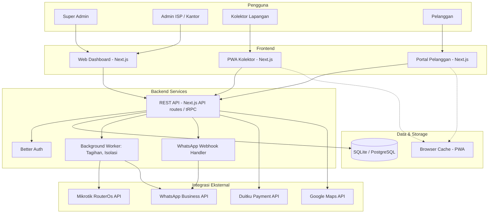
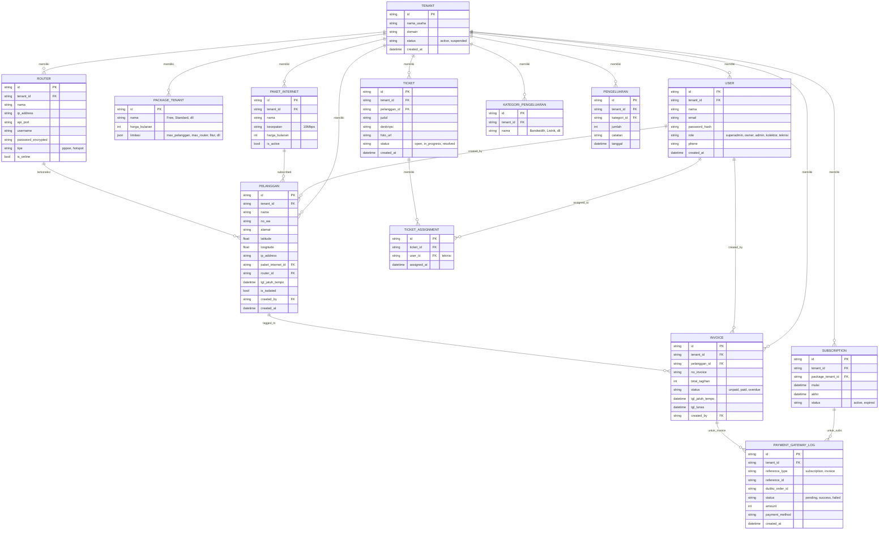

# PRD — Project Requirements Document

## 1. Overview
NetManage adalah platform SaaS (Software-as-a-Service) yang menyediakan solusi lengkap manajemen bisnis untuk penyedia layanan internet (ISP) dan pengelola jaringan RT-RW Net. Aplikasi ini mengintegrasikan pencatatan pelanggan, billing otomatis, kontrol perangkat Mikrotik, penagihan di lapangan, portal pelanggan, dan pelaporan keuangan dalam satu sistem terpadu.

**Masalah utama yang diatasi:**
- Banyak ISP / RT-RW Net masih mencatat pelanggan dan tagihan secara manual (Excel, kertas), rawan lupa, sulit ditelusuri.
- Proses isolasi/cabut internet pelanggan yang menunggak harus dilakukan manual ke router.
- Petugas penagih di lapangan kesulitan menemukan alamat dan harus kembali ke kantor untuk mencatat pembayaran.
- Pelanggan tidak bisa mengecek tagihan atau melapor gangguan secara mandiri, bergantung penuh ke kontak admin.

**Tujuan utama:**
Menjadi “otak” bisnis ISP yang mengotomasi seluruh siklus: akuisisi pelanggan, manajemen langganan, penagihan, pembayaran, aduan, hingga laporan keuangan. Dengan model SaaS, setiap ISP bisa langsung berlangganan tanpa perlu membangun infrastruktur sendiri.

## 2. Requirements
- **Multi‑tenant penuh**: Setiap ISP memiliki database terisolasi secara logis (tenant ID), tidak bisa melihat data ISP lain.
- **Hak akses berbasis peran**: Setidaknya Super Admin (pengelola platform), Owner/Kantor ISP, Kolektor Lapangan, dan Pelanggan.
- **Integrasi Mikrotik RouterOS**: Mendukung API untuk PPPoE/Hotspot, limitasi bandwidth, isolasi/aktifkan otomatis, dan monitoring status.
- **Payment Gateway Duitku**: Untuk pembayaran langganan SaaS (tenant) dan pembayaran tagihan internet pelanggan.
- **WhatsApp REST API** (misal WABA / webhook): Kirim notifikasi tagihan, OTP, status pembayaran, tiket.
- **Pemetaan GIS & ODP**: Simpan koordinat rumah pelanggan; gunakan peta untuk navigasi kolektor dan pemetaan infrastruktur ODP.
- **Offline‑capable PWA** untuk perangkat kolektor lapangan, dengan cache data tagihan dan sinkronisasi setelah daring.
- **Keamanan**: Autentikasi pelanggan tanpa password (passwordless OTP via WhatsApp). Admin dan kolektor login dengan email/kata sandi.
- **Pelaporan & Ekspor**: Laporan keuangan laba rugi, tagihan, ekspor Excel/PDF.
- **Integrasi printer thermal Bluetooth** via Web Bluetooth API.

## 3. Core Features

### Super Admin (Pengelola Platform)
- **Manajemen Tenant**: Verifikasi, aktifkan/nonaktifkan, lihat status semua ISP. (Pendaftaran mandiri oleh calon ISP langsung mengaktifkan tenant setelah pembayaran, Super Admin dapat menonaktifkan jika diperlukan.)
- **Paket SaaS**: Buat/edit paket berlangganan (Free, Standard, Premium) dengan limit fitur, limit maksimal pelanggan internet, dan harga langganan. Limitasi dikemas dalam satu paket yang jelas terlihat saat pendaftaran.
- **Monitoring Transaksi SaaS**: Rekapan pembayaran langganan tenant lewat Duitku.
- **Approval Paket Custom**: Aktifkan paket khusus di luar paket standar atas permintaan tenant.
- **System Health**: Pantau penggunaan server, antrean API WhatsApp.

### Owner / Staf Kantor ISP
- **Manajemen Pelanggan**: Registrasi, ubah paket, catat koordinat GPS, IP, jatuh tempo.
- **Multi‑Router Mikrotik**: Tambah/hapus router, sinkronisasi PPPoE/Hotspot, remote tunnel, status up/down.
- **Paket Internet**: Atur paket (nama, speed limit, harga sewa), biaya tambahan (sewa alat, IP publik).
- **Helpdesk Tiket**: Terima laporan gangguan dari pelanggan, tetapkan teknisi, lacak status.
- **Laporan Keuangan**: Pemasukan, pengeluaran, laba rugi, rekonsiliasi, ekspor.
- **Manajemen Staf**: Buat akun kasir, teknisi, kolektor; atur hak akses menu.

### Kolektor Lapangan (PWA)
- **Daftar Tugas Cerdas**: Tagihan yang belum lunas diurutkan berdasarkan jarak dari posisi kolektor.
- **Navigasi Satu Ketuk**: Buka Google Maps/Waze langsung ke titik rumah pelanggan.
- **Entri Pembayaran Tunai**: Konfirmasi terima uang, langsung aktifkan internet (bila terisolir) via API Mikrotik.
- **Cetak Struk Bluetooth**: Cetak bukti bayar dengan printer thermal portable.
- **Offline Cache**: Lihat daftar tugas meski tanpa sinyal, data tersimpan lokal.

### Portal Pelanggan (Aplikasi Android / PWA)
- **Login Tanpa Password**: Masuk dengan nomor WhatsApp terdaftar + OTP.
- **Ringkasan Langganan**: Masa aktif, tagihan berjalan, riwayat invoice.
- **Pembayaran Mandiri**: Bayar via QRIS, VA bank, atau deep‑link ke e‑wallet (GoPay, OVO) — pakai Duitku SDK.
- **Self‑Diagnostic**: Speed test bawaan, cek koneksi ke server lokal vs internet.
- **Pengaduan Mandiri**: Form laporan gangguan + foto kondisi modem/kabel.

### Aplikasi Android v1 (dua APK hybrid)

Rilis mobile v1 memakai **dua aplikasi Android terpisah** (Capacitor + WebView ke production HTTPS), bukan satu APK untuk semua role:

| Aplikasi | Persona | Entry web |
|----------|---------|-----------|
| **NetManage Admin** | owner, admin, kolektor, teknisi | `/login` |
| **NetManage Portal** | pelanggan | `/portal/login` |

**Superadmin** tidak didukung di app mobile — tetap via browser desktop.

Distribusi: APK internal (fase 1) → Google Play (fase 2). Spesifikasi lengkap: [`docs/prd-android-v1.md`](docs/prd-android-v1.md).

## 4. User Flow

### Alur Pendaftaran Tenant Baru (Self‑Service)
1. Calon ISP mengisi formulir pendaftaran: nama usaha, email, domain yang diinginkan, dan data admin awal.
2. Di formulir yang sama, calon tenant melihat perbandingan paket SaaS (Free, Standard, Premium) beserta limitasi yang jelas: jumlah maksimal pelanggan internet, fitur yang didapat, dan harga per bulan/tahun.
3. Calon tenant memilih salah satu paket. Jika memilih paket berbayar, sistem langsung mengarahkan ke halaman checkout dengan opsi pembayaran QRIS atau transfer virtual account via Duitku.
4. Setelah pembayaran berhasil (terkonfirmasi oleh webhook Duitku), sistem otomatis:
   - Mengaktifkan tenant dan membuat akun admin pertama sesuai data pendaftaran.
   - Mengirim email notifikasi selamat datang berisi tautan login dan panduan awal.
   - Mencatat langganan aktif di database mulai dari tanggal pembayaran.
5. Admin ISP yang baru dibuat bisa langsung masuk ke dashboard dan mulai menyiapkan router, paket internet, serta pelanggan pertama. Super Admin juga dapat memantau tenant yang baru aktif melalui panel manajemen.

### Alur Penagihan ke Pelanggan (Admin ISP)
1. Admin membuat paket internet dan menambahkan pelanggan (isi profil, koordinat, paket, tanggal jatuh tempo).
2. Beberapa hari sebelum jatuh tempo, sistem kirim notifikasi WhatsApp ke pelanggan.
3. Setelah melewati masa tenggang, pelanggan diisolasi otomatis via Mikrotik (jika diatur).
4. Kolektor lapangan mendapat daftar tugas penagihan harian.
5. Kolektor mendatangi pelanggan, menerima uang tunai, catat di aplikasi.
6. Sistem otomatis mengaktifkan kembali koneksi pelanggan dan mencetak struk.

### Alur Pembayaran Mandiri Pelanggan
1. Pelanggan login dengan WhatsApp OTP.
2. Melihat tagihan “Belum Lunas”.
3. Klik “Bayar”, pilih metode (QRIS/VA/e-wallet).
4. Duitku memproses pembayaran, webhook menginformasikan sistem.
5. Status tagihan berubah menjadi “Lunas”, pelanggan mendapat notifikasi WhatsApp.

### Alur Tiket Gangguan
1. Pelanggan mengisi form laporan (deskripsi, foto) dari portal.
2. Tiket masuk ke dashboard ISP, otomatis dikirim ke teknisi terdekat (berdasarkan koordinat).
3. Teknisi menerima notifikasi, update status (dalam penanganan, selesai).
4. Pelanggan bisa melihat progres tiket di portal.

## 5. Architecture

Komunikasi antar komponen dijelaskan pada diagram berikut. Frontend terdiri dari: Web Dashboard (Admin ISP & Super Admin), Aplikasi Mobile Kolektor (PWA), dan Portal Pelanggan (PWA/Android). Semua berkomunikasi dengan API backend yang sama.

**Penjelasan singkat:**
- **Next.js** bertindak sebagai aplikasi universal (frontend + backend API).
- **Better Auth** menangani login untuk semua peran. Pelanggan menggunakan passwordless OTP via WhatsApp.
- **Background Worker** (bisa menggunakan cron di Next.js atau Inngest) menangani tugas otomatis: pengiriman notifikasi jatuh tempo, isolasi pelanggan menunggak.
- **Mikrotik API** diakses langsung dari backend, menggunakan SSH atau REST Mikrotik.
- **WhatsApp Webhook** menerima konfirmasi pengiriman/penerimaan OTP.
- **Duitku Payment** digunakan untuk dua keperluan: langganan tenant (saat pendaftaran dan perpanjangan) dan pembayaran invoice pelanggan (Linked Account per tenant).

## 6. Database Schema

Berikut adalah skema database yang mendukung multi-tenant dan semua fitur utama.

**Keterangan:**
- Tabel `PACKAGE_TENANT` menyimpan `limitasi` sebagai JSON yang mencakup `max_pelanggan`, `max_router`, serta daftar fitur yang diaktifkan (misal: `["tiket", "laporan_keuangan", "api_mikrotik"]`).
- `PAYMENT_GATEWAY_LOG` menyimpan log pembayaran baik dari langganan tenant (saat pendaftaran atau perpanjangan) maupun tagihan pelanggan (polimorfik melalui `reference_type` + `reference_id`).
- Koordinat pelanggan disimpan sebagai `latitude`/`longitude` untuk pemetaan dan pengurutan jarak.
- Semua tabel wajib memiliki `tenant_id` untuk isolasi data.

## 7. Tech Stack

| Komponen | Teknologi | Keterangan |
|----------|-----------|------------|
| **Frontend & Backend** | Next.js (App Router) | Full-stack React framework, satu codebase untuk semua aplikasi. |
| **Styling** | Tailwind CSS | Utility class untuk UI yang cepat dan konsisten. |
| **Komponen UI** | shadcn/ui | Koleksi komponen React headless yang bisa dikustomisasi. |
| **Autentikasi** | Better Auth | Menangani login password-based (admin/kolektor) dan passwordless (pelanggan via OTP WhatsApp). |
| **ORM & Migrasi** | Drizzle ORM | Query builder yang aman, mendukung SQLite awal, mudah migrasi ke PostgreSQL. |
| **Database** | SQLite (dev) → PostgreSQL (production) | Mulai dari file lokal untuk cepat, lalu pindah ke PostgreSQL untuk production multi-tenant. |
| **Payment Gateway** | Duitku API + SDK | Untuk menerima pembayaran langganan SaaS dan invoice pelanggan, termasuk QRIS saat pendaftaran tenant. |
| **Mikrotik API** | MikroNode / node-routeros | Library Node.js untuk berkomunikasi dengan RouterOS. |
| **WhatsApp API** | WhatsApp Business API (WABA) | Webhook resmi untuk mengirim OTP dan notifikasi. |
| **Peta & GIS** | Google Maps API / Mapbox | Tampilan peta di dashboard dan PWA kolektor. |
| **Print Thermal** | Web Bluetooth API | Untuk cetak struk dari PWA kolektor. |
| **Background Tasks** | Inngest / Next.js Cron | Menangani penjadwalan isolasi, notifikasi, dan aktivasi otomatis tenant pasca pembayaran. |
| **Hosting** | Vercel + Docker | Next.js di Vercel, background worker bisa di Railway atau server terpisah. |

Semua bagian telah disesuaikan dengan kebutuhan NetManage, memaksimalkan produktivitas tim dan skalabilitas. Pendaftaran tenant kini bersifat self‑service dengan pemilihan paket dan pembayaran instan melalui QRIS, mengurangi hambatan masuk bagi calon ISP.

## 8. Dokumentasi Aplikasi Android v1

Dokumen implementasi mobile (baseline web `v1.0.0`):

| Dokumen | Isi |
|---------|-----|
| [`docs/prd-android-v1.md`](docs/prd-android-v1.md) | PRD produk: scope dua app, user stories, NFR |
| [`docs/android-app-plan.md`](docs/android-app-plan.md) | Rencana teknis hybrid, fase Capacitor |
| [`docs/android-ui-ux-spec.md`](docs/android-ui-ux-spec.md) | Spesifikasi UI/UX, wireframe notes, komponen |
| [`docs/android-ux-research.md`](docs/android-ux-research.md) | Riset pain points audit web mobile |
| [`docs/android-qa-checklist.md`](docs/android-qa-checklist.md) | Checklist QA device sebelum rilis APK |
| [`docs/design/android/`](docs/design/android/) | Folder export wireframe, mockup, icon |