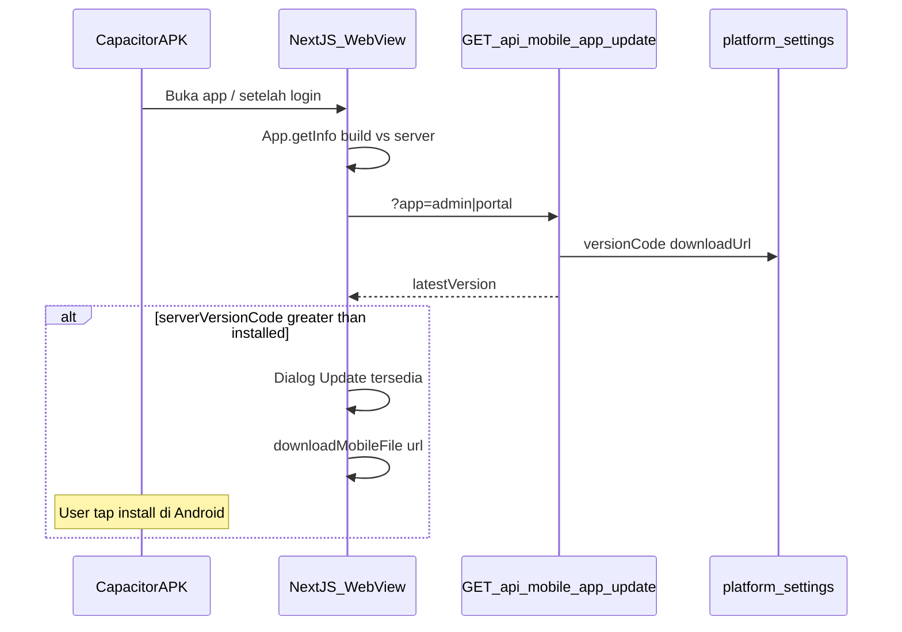
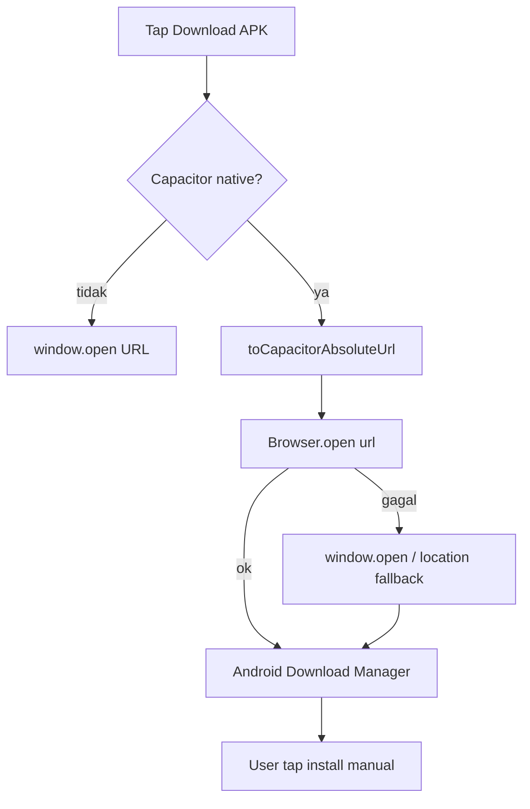

# Plan Implementasi — Update Otomatis APK (Admin.net + MyWiFi)

Dokumen ini merinci fitur **cek versi in-app** dan **prompt unduh APK** untuk distribusi internal (sideload).

**Status:** belum diimplementasi — rencana desain.

**Prioritas:** perbaiki **download Community di APK** terlebih dahulu (Phase 0), baru fitur cek versi otomatis (Phase 1+).

**Scope MVP (disetujui):**
- **Admin.net** + **MyWiFi**
- Cek versi saat app dibuka → dialog **"Update tersedia"** → unduh APK → user install manual di Android
- **Bukan** install otomatis 1-tap (fase 2)

**Domain production:** `https://isp.tunnelhost.my.id` (SQLite) / `https://billisp.tunnelhost.my.id` (PostgreSQL).

---

## Ringkasan arsitektur



**Alur singkat:**

1. Superadmin upload APK baru + isi **version code** / **version name** di dashboard.
2. Server menyimpan metadata versi di `platform_settings` bersama URL download.
3. User buka APK (Capacitor) → client baca versi terpasang via `@capacitor/app`.
4. Client fetch API → bandingkan `versionCode` → jika server lebih baru, tampilkan dialog.
5. User tap **Unduh update** → APK terdownload → install manual dari notifikasi download / file manager.

---

## Yang sudah ada di kode

| Komponen | Status | Lokasi |
|----------|--------|--------|
| Upload APK superadmin | ✅ | `/superadmin/mobile-apk`, `src/features/mobile-apk/actions.ts` |
| Simpan file APK | ✅ | `src/lib/uploads.ts` → `public/uploads/mobile-apk/` |
| URL download di Community | ✅ | `communityApkAdminUrl`, `communityApkPortalUrl` |
| Download Capacitor-aware | ✅ Phase 0 | `downloadApkFile()` + `@capacitor/browser` |
| Deteksi shell admin/portal | ✅ | `src/lib/mobile/use-mobile-shell.ts` → `getNetManageApp()` |
| `@capacitor/app` (MyWiFi) | ✅ | `mobile/portal/package.json` |
| `@capacitor/app` (Admin.net) | ❌ | Belum ada — wajib ditambah |
| Metadata versi APK di DB | ❌ | Belum ada |
| API cek update | ❌ | Belum ada |
| Bootstrap cek versi in-app | ❌ | Belum ada |

### Versi APK saat ini (lokal Gradle)

| APK | versionCode | versionName | File Gradle |
|-----|-------------|-------------|-------------|
| Admin.net | 2 | 1.0.1 | `mobile/admin/android/app/build.gradle` |
| MyWiFi | 1 | 1.0 | `mobile/portal/android/app/build.gradle` |

> Versi di Gradle **belum tersinkron** ke server. Setelah fitur live, angka ini harus sama dengan yang diinput saat upload superadmin.

---

## Phase 0 — Perbaikan download Community di APK (wajib dulu)

### Gejala

Tombol **Download APK** di `/dashboard/community` tidak berfungsi di **Admin.net APK** (dan kemungkinan MyWiFi): tap tombol tidak mengunduh, tidak ada reaksi, atau WebView berperilaku aneh.

### Penyebab (diagnosis)

| # | Penyebab | Penjelasan |
|---|----------|------------|
| 1 | **`target="_blank"` di WebView** | Sudah diperbaiki (commit `ced7634`) — diganti `CommunityLinkButton` + `downloadMobileFile()`. **Tapi server production harus sudah deploy** commit ini. |
| 2 | **Strategi fetch+blob tidak andal di Android WebView** | Implementasi saat ini (`fetch` → `blob` → `<a download>`) sering **diabaikan** oleh WebView Capacitor untuk file APK (~4 MB). Atribut `download` pada blob URL tidak memicu Download Manager Android. |
| 3 | **Fallback `location.assign`** | Memuat URL APK **di dalam WebView** (bukan unduh) — user melihat layar kosong/garbled, bukan prompt install. |
| 4 | **URL Community kosong / file belum di-upload** | `communityApkAdminUrl` null atau file tidak ada di `public/uploads/mobile-apk/` di server production. |
| 5 | **`NEXT_PUBLIC_APP_URL` salah** | URL relatif resolve ke `capacitor://localhost` — unduh gagal. Upload superadmin harus menghasilkan URL absolut `https://isp.tunnelhost.my.id/uploads/...`. |
| 6 | **Belum ada `@capacitor/browser`** | Plugin ini membuka URL di **browser sistem / Chrome Custom Tab** tempat unduh APK **benar-benar jalan**. Belum terpasang di admin maupun portal. |

### Verifikasi cepat (production)

```bash
# 1. Pastikan kode terbaru sudah deploy
cd ~/htdocs/isp.tunnelhost.my.id && git log -1 --oneline
# Harus >= ced7634 (Community download fix)

# 2. Cek URL APK di DB / superadmin panel
# /superadmin/mobile-apk — harus ada link download Admin.net

# 3. Tes HTTP langsung
curl -I "https://isp.tunnelhost.my.id/uploads/mobile-apk/isp-tunnelhost-my-id-Admin-net-release.apk"
# Harus: HTTP 200, Content-Type: application/vnd.android.package-archive
#        Content-Disposition: attachment; filename="..."
```

Di browser desktop, buka URL yang sama — harus unduh APK. Jika 404, upload ulang via superadmin.

### Rencana perbaikan (masuk scope plan ini)

**0a. Pastikan deploy + data production**

- Deploy server: `git pull` + build + `pm2 restart billingisp`
- Upload APK via `/superadmin/mobile-apk` jika URL Community masih kosong
- Pastikan `NEXT_PUBLIC_APP_URL=https://isp.tunnelhost.my.id` di `.env` production

**0b. Perbaiki `downloadApkFile()` untuk APK di Capacitor** ✅ spesifikasi siap implement

File: [`src/lib/mobile/open-external-url.ts`](src/lib/mobile/open-external-url.ts)

Ganti strategi fetch+blob dengan **Capacitor Browser plugin** (akses via `window.Capacitor.Plugins.Browser` — sama seperti push, tanpa perlu dep di root Next.js):

```typescript
// Pola akses plugin (tanpa import npm di bundle Next.js)
function getBrowserPlugin() {
  return window.Capacitor?.Plugins?.Browser ?? null;
}

export async function downloadApkFile(url: string): Promise<void> {
  const resolved = resolveMobileUrl(url);
  if (!isNativeCapacitor()) {
    window.open(resolved, "_blank");
    return;
  }
  const browser = getBrowserPlugin();
  if (browser?.open) {
    await browser.open({ url: resolved });
    return;
  }
  throw new Error("Plugin Browser belum ada — rebuild APK setelah cap sync.");
}
```

Hapus: `fetch` → `blob` → `<a download>` (tidak andal di WebView).

**0c. Tambah plugin `@capacitor/browser`** ✅ spesifikasi siap implement

```bash
# Admin.net
cd mobile/admin && npm install @capacitor/browser@^7.0.2 && npm run sync

# MyWiFi
cd mobile/portal && npm install @capacitor/browser@^7.0.2 && npm run sync
```

Bump versi Admin.net di `build.gradle` → `versionCode 3`, `versionName "1.0.2"`.

**0d. Feedback UI di Community** ✅ spesifikasi siap implement

File: [`src/components/community/community-link-button.tsx`](src/components/community/community-link-button.tsx)

- Import `useToast`, state `busy`
- Panggil `downloadApkFile(href)` (bukan `downloadMobileFile`)
- Toast sukses: "Cek notifikasi Download di HP"
- Toast error jika plugin/URL gagal
- Label tombol: "Membuka unduh…" saat busy

**0e. Deploy + rebuild urutan**

1. Commit & push perubahan web (`open-external-url.ts`, `community-link-button.tsx`)
2. Deploy server: `git pull && npm run build && pm2 restart billingisp`
3. Rebuild APK lokal: `npm run mobile:apk -- --admin-only --skip-assets`
4. Upload APK baru via `/superadmin/mobile-apk` (opsional jika link Community sudah benar)
5. Install APK v1.0.2 di HP → uji Community download

| # | Skenario | Expected |
|---|----------|----------|
| 1 | Tap Download APK di Community (Admin.net APK) | Browser sistem terbuka / Download Manager mulai unduh |
| 2 | Tap Download APK di browser mobile biasa | Unduh normal |
| 3 | URL APK 404 | Toast error jelas, bukan silent fail |
| 4 | `communityApkAdminUrl` kosong | Tombol download tidak tampil (sudah ada) |



---

## Yang perlu dibangun

### 1. Schema — metadata versi APK

Tambah kolom di `platform_settings` (SQLite + PostgreSQL + `schema-patches.ts`):

| Kolom DB | Tipe | Contoh |
|----------|------|--------|
| `mobile_apk_admin_version_code` | integer | `2` |
| `mobile_apk_admin_version_name` | text | `1.0.1` |
| `mobile_apk_portal_version_code` | integer | `2` |
| `mobile_apk_portal_version_name` | text | `1.0.1` |
| `mobile_apk_admin_release_notes` | text nullable | opsional |
| `mobile_apk_portal_release_notes` | text nullable | opsional |

**Aturan:** Perbandingan update memakai **`versionCode`** (integer monotonik), bukan `versionName`.

**File terkait:**
- `src/lib/db/schema.sqlite.ts`
- `src/lib/db/schema.pg.ts`
- `src/lib/db/schema-patches.ts`
- `src/features/platform-settings/defaults.ts`
- `src/features/platform-settings/service.ts`
- `src/features/platform-settings/actions.ts`

---

### 2. Upload APK — simpan versi bersama URL

Perluas form upload superadmin:

- Input wajib: **Version code** (number) + **Version name** (string)
- Opsional: **Release notes**
- Validasi: `versionCode` ≥ 1; tolak jika ≤ versi yang sudah terpublish (anti-downgrade tidak sengaja)
- Saat upload sukses: update URL Community **dan** kolom versi
- Tampilkan badge versi live di panel upload

**File terkait:**
- `src/features/mobile-apk/actions.ts`
- `src/app/superadmin/mobile-apk/mobile-apk-upload-panel.tsx`

---

### 3. API publik cek update

**Endpoint:** `GET /api/mobile/app-update?app=admin|portal`

**File baru:** `src/app/api/mobile/app-update/route.ts`

**Response contoh:**
```json
{
  "ok": true,
  "app": "admin",
  "versionCode": 2,
  "versionName": "1.0.1",
  "downloadUrl": "https://isp.tunnelhost.my.id/uploads/mobile-apk/isp-tunnelhost-my-id-Admin-net-release.apk",
  "releaseNotes": "Perbaikan download Community"
}
```

- Tanpa auth (metadata publik, sama seperti link download Community)
- Return `{ ok: false }` jika URL atau `versionCode` belum diset
- API mengembalikan URL absolut (`NEXT_PUBLIC_APP_URL` + path)

---

### 4. Client bootstrap — cek versi + dialog unduh

**File baru:**
- `src/components/mobile/mobile-app-update-bootstrap.tsx` — UI dialog
- `src/lib/mobile/app-update-client.ts` — fetch + compare logic

**Logika client:**

1. Hanya jalan jika `isNativeCapacitor()` dan `getNetManageApp()` = `admin` | `portal`
2. `App.getInfo()` → `build` (= versionCode Android), `version` (= versionName)
3. Fetch `/api/mobile/app-update?app=...` via `toCapacitorAbsoluteUrl()`
4. Jika `server.versionCode > Number(installed.build)`:
   - Dialog: judul **Update tersedia**, versi lama → baru, release notes
   - Tombol **Unduh update** → `downloadApkFile(downloadUrl)` (helper sama dengan Community — Phase 0)
   - Tombol **Nanti** → dismiss session
5. Throttle: maksimal 1× per session (`sessionStorage`) agar tidak ganggu setiap navigasi
6. Skip di halaman login (`/login`, `/portal/login`)

**Mount:** `src/app/layout.tsx` (berdampingan `PushNotificationBootstrap`)

---

### 5. Native shell — plugin Capacitor untuk Admin.net

Admin.net belum punya plugin berikut (MyWiFi sudah punya `@capacitor/app`):

| Plugin | Fungsi |
|--------|--------|
| `@capacitor/app` | Baca versionCode terpasang (Phase 4 — auto update) |
| `@capacitor/browser` | Unduh APK via browser sistem (Phase 0 — Community download) |

```bash
cd mobile/admin
npm install @capacitor/app @capacitor/browser
npm run sync
```

Portal: tambahkan `@capacitor/browser` jika belum ada.

Lalu rebuild APK Admin.net + MyWiFi dengan **versionCode** naik (plugin native masuk binary).

**File terkait:**
- `mobile/admin/package.json`
- `mobile/portal/package.json`
- `mobile/admin/android/app/build.gradle` (bump versi)

---

### 6. UX tambahan (ringan)

- Badge **Versi live: 1.0.1 (code 2)** di panel upload superadmin
- Opsional: tampilkan versi terpasang di halaman `/dashboard/community`
- Update `mobile/README.md` — alur publish versi

---

## Workflow publish APK (setelah fitur live)

```text
1. Developer — naikkan versionCode + versionName di build.gradle
2. Build APK:
   npm run mobile:apk -- --admin-only
   npm run mobile:apk -- --portal-only
3. Superadmin — /superadmin/mobile-apk
   - Upload APK
   - Isi version code + version name (HARUS sama dengan build.gradle)
   - Isi release notes (opsional)
4. User buka APK versi lama → dialog update muncul
5. User unduh + install manual
```

### Contoh bump versi (Admin.net)

`mobile/admin/android/app/build.gradle`:
```gradle
versionCode 3
versionName "1.0.2"
```

Saat upload superadmin: **Version code = 3**, **Version name = 1.0.2**.

---

## Yang sengaja tidak termasuk (MVP)

| Item | Alasan | Fase berikutnya |
|------|--------|-----------------|
| Install otomatis 1-tap | Butuh `REQUEST_INSTALL_PACKAGES` + native bridge / custom plugin | Fase 2 |
| Push FCM "APK baru tersedia" | Bisa ditambah setelah foundation versi jalan | Fase 2 |
| Force update wajib | Butuh kolom `minVersionCode` + dialog non-dismissable | Fase 2 |
| Parse versionCode dari file APK di server | Kompleks; form manual lebih andal | — |
| Play Store in-app update | Distribusi internal sideload, bukan Play Store | — |

---

## Checklist verifikasi

| # | Skenario | Expected |
|---|----------|----------|
| 1 | APK terpasang code 1, server code 2 | Dialog update muncul |
| 2 | APK terpasang code 2, server code 2 | Tidak ada dialog |
| 3 | Browser biasa (bukan Capacitor) | Bootstrap tidak jalan |
| 4 | Upload APK tanpa version code | Validasi error |
| 5 | Upload dengan version code ≤ versi live | Validasi error (anti-downgrade) |
| 6 | Tap **Unduh update** di dialog | APK terdownload; user bisa install |
| 7 | Tap **Nanti** | Dialog tidak muncul lagi di session yang sama |
| 8 | MyWiFi vs Admin.net | Masing-masing cek versi app-nya sendiri |

---

## Checklist implementasi

**Phase 0 — Download Community (prioritas)** — implementasi kode selesai

- [x] Refactor `open-external-url.ts` → `downloadApkFile` + Browser plugin
- [x] Update `community-link-button.tsx` — toast + loading state
- [x] `npm install @capacitor/browser` + sync admin + portal
- [x] Bump `build.gradle` Admin.net → 1.0.2 (code 3)
- [ ] Commit, push, deploy server production
- [ ] Rebuild APK + uji unduh dari halaman Community
- [ ] Verifikasi URL APK ter-upload di production

**Phase 1+ — Auto update versi**

- [ ] Kolom versi APK di `platform_settings` (SQLite + PG + patches)
- [ ] Form upload: versionCode, versionName, releaseNotes
- [ ] Validasi anti-downgrade saat upload
- [ ] `GET /api/mobile/app-update`
- [ ] `MobileAppUpdateBootstrap` + `app-update-client.ts`
- [ ] Mount bootstrap di `layout.tsx`
- [ ] `@capacitor/app` di Admin.net + sync + rebuild APK
- [ ] Rebuild MyWiFi APK (versi sinkron)
- [ ] Deploy server + upload APK baru ke production
- [ ] Uji di device Android (Admin.net + MyWiFi)

**Estimasi:** Phase 0 ~0.5 hari | Phase 1+ ~1 hari | rebuild & sideload 2 APK.

---

## Relasi dengan fitur lain

| Fitur | Hubungan |
|-------|----------|
| [Community page](/dashboard/community) | **Phase 0:** perbaiki unduh APK di WebView; link manual tetap ada |
| [Upload APK superadmin](/superadmin/mobile-apk) | Sumber kebenaran versi + file APK |
| [Push notification](android-push-notification-plan.md) | Fase 2: push saat APK baru di-upload |
| Deploy web (`/superadmin/deploy`) | Perubahan web (dialog update) perlu deploy server; user lama tetap perlu APK rebuild sekali untuk dapat `@capacitor/app` |

---

## Catatan penting

1. **WebView vs native:** Sebagian besar UI Admin.net/MyWiFi dimuat dari server HTTPS. Fix web Community **perlu deploy server** + **rebuild APK** jika menambah plugin `@capacitor/browser`. Tanpa rebuild, deploy server saja tidak cukup untuk unduh APK yang andal.
2. **Install manual:** Android modern tidak mengizinkan install APK sepenuhnya silent tanpa izin khusus. User tetap konfirmasi install setelah unduh.
3. **Sinkron versi:** Selalu samakan angka `build.gradle` dengan input upload superadmin. Ketidakcocokan menyebabkan dialog update tidak muncul atau muncul salah.
4. **Urutan rollout:** Deploy server (Phase 0b UI toast) → rebuild APK dengan `@capacitor/browser` (Phase 0c) → upload APK baru → baru Phase 1+ auto-update versi.
