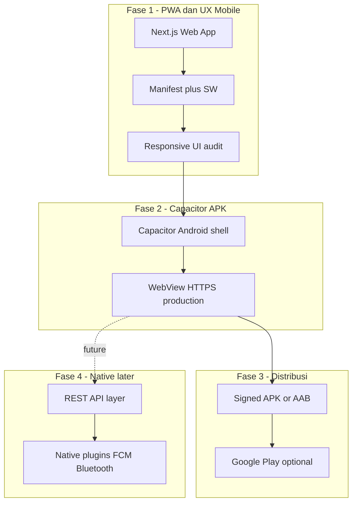

# Rencana Build App Android (Hybrid)

> Rencana hybrid untuk app Android (semua role: superadmin, ISP admin, kolektor, portal pelanggan): perkuat PWA + UX mobile di codebase Next.js existing, lalu wrap dengan Capacitor menjadi APK; fase lanjutan menambah REST API dan modul native bila diperlukan.

**Status:** Draft — belum dieksekusi  
**Pendekatan:** Hybrid (APK via Capacitor dulu, native nanti jika perlu)  
**Scope:** Full app (semua role)  
**Estimasi MVP APK:** ~1 minggu

---

## Checklist implementasi

- [ ] Audit & perbaiki responsive UI untuk `/kolektor`, `/portal`, `/isp`, login (touch target, tabel mobile)
- [ ] Perkuat manifest (512 icon, start_url, viewport meta) dan perluas service worker offline kolektor
- [ ] Tambah `GET /api/mobile/kolektor/tasks` (auth cookie) untuk cache offline
- [ ] Buat folder `mobile/` Capacitor, config `server.url` production, permissions Android
- [ ] Generate signed APK/AAB, splash screen, adaptive icon dari asset existing
- [ ] QA di device nyata: auth semua role, GPS, Bluetooth print, Duitku redirect, session persist
- [ ] Siapkan listing Play Store (privacy policy, screenshot) atau sideload APK internal
- [ ] Fase lanjutan: REST API v1 + plugin native jika WebView blocker terbukti

---

## Konteks codebase saat ini

Aplikasi **BILLING RT-RW NET** sudah berbasis Next.js App Router dengan fondasi mobile:

| Aspek | Status | File kunci |
|-------|--------|------------|
| PWA manifest | Ada | `src/app/manifest.ts` |
| Service worker | Dasar (cache shell) | `public/sw.js` |
| Registrasi SW | Ada | `src/components/pwa-register.tsx` |
| Kolektor mobile | GPS sort, tunai, Bluetooth print | `src/app/kolektor/kolektor-tasks.tsx` |
| Portal pelanggan | OTP, bayar, diagnostik | `src/app/portal/` |
| Auth | Cookie session `nm_session` | `src/lib/auth/session.ts` |
| API publik | Hampir tidak ada — bisnis via **Server Actions** | `src/features/**/actions.ts` |

**Implikasi penting:** App Android fase 1 **tidak perlu rewrite backend** jika memakai **WebView ke URL production** (`https://isp.tunnelhost.my.id`). Server Actions & cookie session tetap jalan selama HTTPS + same-origin.

PRD sudah mengarahkan kolektor & portal sebagai PWA/Android — selaras dengan pendekatan hybrid.



---

## Rekomendasi arsitektur hybrid

**Fase 1–2 (sekarang):** Capacitor + WebView → satu APK **full app** (login → routing ke role yang sesuai, sama seperti web).

**Fase 4 (nanti):** Ekstrak REST API + React Native/Expo **hanya jika** WebView tidak cukup (push notification, Bluetooth printer bermasalah, offline kompleks).

**Mengapa Capacitor (bukan React Native langsung):**

- Reuse 100% UI & logic existing
- Plugin native (Geolocation, Bluetooth, Push) bisa ditambah bertahap
- Satu tim, satu deploy web + mobile shell

**Mengapa bukan TWA murni:** TWA lebih terbatas untuk plugin native & splash/branding; Capacitor lebih cocok untuk roadmap hybrid.

---

## Fase 0 — Prasyarat production

Sebelum APK, pastikan web production stabil:

1. HTTPS aktif di `https://isp.tunnelhost.my.id`
2. Set `.env`:
   ```env
   NEXT_PUBLIC_APP_URL=https://isp.tunnelhost.my.id
   ```
3. Cookie session: `secure: true` di production (sudah di `src/lib/auth/session.ts`)
4. Pertimbangkan `SameSite=None; Secure` **hanya jika** nanti perlu iframe/deep link cross-site (biasanya tidak perlu untuk Capacitor same-origin WebView)

---

## Fase 1 — Perkuat PWA & UX mobile (di repo Next.js)

### 1.1 Manifest & installability

Update `src/app/manifest.ts`:

- `start_url`: `/login` (atau `/` dengan redirect)
- `scope`: `/`
- `display`: `standalone`
- `orientation`: `portrait` (opsional, kolektor/portal)
- Icon 512x512 untuk Play Store (generate dari `public/icon.png`)
- `categories`: `business`, `finance`

Tambah meta di `src/app/layout.tsx`:

```html
<meta name="mobile-web-app-capable" content="yes" />
<meta name="apple-mobile-web-app-capable" content="yes" />
<meta name="viewport" content="width=device-width, initial-scale=1, viewport-fit=cover" />
```

### 1.2 Service worker — offline kolektor (PRD)

Perluas `public/sw.js`:

- Cache route `/kolektor` + aset statis (`/_next/static/*`)
- Cache API response tugas (butuh endpoint GET ringan — lihat 1.4)
- Strategi: stale-while-revalidate untuk daftar tagihan
- Version cache (`billing-v2`) + skipWaiting

Saat ini SW **belum** cache data invoice — PRD minta offline kolektor belum terpenuhi penuh.

### 1.3 Responsive audit per area

| Area | Route | Prioritas mobile | Catatan |
|------|-------|------------------|---------|
| Kolektor | `/kolektor` | Tinggi | Sudah card-based; perbesar touch target |
| Portal | `/portal/*` | Tinggi | Bottom nav sudah ada di `portal-nav.tsx` |
| ISP admin | `/isp/*` | Sedang | Banyak tabel — tambah horizontal scroll / card view mobile |
| Superadmin | `/superadmin/*` | Rendah | Boleh desktop-first, minimal usable |
| Login | `/login`, `/portal/login` | Tinggi | Sudah OK |

Perubahan UI tipikal:

- Sidebar `app-shell.tsx` → sudah drawer mobile
- Tabel ISP → wrapper `overflow-x-auto` atau komponen `MobileTable`
- Tombol aksi min 44px tinggi (guideline touch)

### 1.4 (Opsional tapi disarankan) API ringan untuk mobile offline

Tambah route read-only JSON (auth via cookie):

```
GET /api/mobile/kolektor/tasks
GET /api/mobile/portal/summary
```

Implementasi tipis di `src/app/api/mobile/` — delegasi ke service existing (`listUnpaidInvoices`). Memudahkan SW cache & fase native nanti.

### 1.5 Fitur perangkat — cek kompatibilitas WebView Android

| Fitur | Web API | Capacitor WebView |
|-------|---------|-------------------|
| GPS sort kolektor | `navigator.geolocation` | Perlu permission Android |
| Cetak thermal | Web Bluetooth | Perlu permission + uji di WebView (Chrome 56+) |
| OTP portal | form + server action | OK |
| Duitku bayar | redirect external | OK (Custom Tabs) |
| Maps navigasi | link Google Maps | OK (intent external) |

Jika Web Bluetooth gagal di WebView → fase 4: plugin `@capacitor-community/bluetooth-le`.

---

## Fase 2 — Capacitor Android shell

### 2.1 Struktur monorepo

```
billingisp/
├── src/                    # Next.js (existing)
├── mobile/                 # NEW - Capacitor project
│   ├── capacitor.config.ts
│   ├── android/
│   └── package.json
```

Atau folder sibling `billingisp-mobile/` — pilih monorepo agar icon/version sinkron.

### 2.2 Setup Capacitor

```bash
cd mobile
npm init -y
npm install @capacitor/core @capacitor/cli @capacitor/android
npm install @capacitor/splash-screen @capacitor/status-bar @capacitor/geolocation
npx cap init "BILLING RT-RW NET" com.klicknet.billingrt --web-dir=../out
```

**Catatan Next.js:** App ini **SSR**, bukan static export penuh. Konfigurasi Capacitor untuk production:

```ts
// capacitor.config.ts
const config = {
  appId: "com.klicknet.billingrt",
  appName: "BILLING RT-RW NET",
  server: {
    url: "https://isp.tunnelhost.my.id",
    cleartext: false,
  },
  android: {
    allowMixedContent: false,
  },
};
```

Dev lokal: `server.url: "http://10.0.2.2:3000"` (emulator) atau IP LAN.

### 2.3 Android permissions (`AndroidManifest.xml`)

```xml
<uses-permission android:name="android.permission.INTERNET" />
<uses-permission android:name="android.permission.ACCESS_FINE_LOCATION" />
<uses-permission android:name="android.permission.ACCESS_COARSE_LOCATION" />
<uses-permission android:name="android.permission.BLUETOOTH" />
<uses-permission android:name="android.permission.BLUETOOTH_CONNECT" />
```

### 2.4 Branding native shell

- Splash screen dari `src/app/icon.png` / adaptive icon
- Status bar color = `theme_color` dari manifest (`#2563eb`)
- App name: **BILLING RT-RW NET**

### 2.5 Build APK

```bash
cd mobile
npx cap add android
npx cap sync android
npx cap open android   # Android Studio
# Build > Generate Signed Bundle/APK
```

Output: `app-release.apk` atau `.aab` untuk Play Store.

### 2.6 Deep link (opsional)

Intent filter untuk `https://isp.tunnelhost.my.id/*` agar link Duitku/WhatsApp kembali ke app.

---

## Fase 3 — Distribusi & QA

### 3.1 Testing checklist Android

- [ ] Login owner/admin/kolektor/superadmin
- [ ] Portal OTP + bayar Duitku (redirect & return)
- [ ] Kolektor: GPS permission, sort jarak, mark paid
- [ ] Cetak struk Bluetooth (printer thermal nyata)
- [ ] Rotasi layar, back button Android
- [ ] Session persist setelah app di-background
- [ ] Offline: buka `/kolektor` tanpa jaringan (setelah fase 1.2)
- [ ] Multi-tenant: tenant A tidak bocor ke tenant B

### 3.2 Distribusi

| Channel | Kapan |
|---------|-------|
| Sideload APK | Uji internal / kolektor lapangan |
| Google Play (AAB) | Production publik |
| PWA install prompt | Tetap sebagai alternatif tanpa Play Store |

Play Store butuh: privacy policy URL, screenshot, deskripsi, content rating.

---

## Fase 4 — Native lanjutan (jika hybrid tidak cukup)

Trigger: Web Bluetooth gagal, push notification wajib, offline sync kompleks, atau performa admin mobile buruk.

### 4.1 REST API layer

Ekstrak dari Server Actions ke `src/app/api/v1/`:

```
POST /api/v1/auth/login
POST /api/v1/auth/otp/request
POST /api/v1/auth/otp/verify
GET  /api/v1/kolektor/tasks
POST /api/v1/invoices/:id/pay-cash
GET  /api/v1/portal/invoices
...
```

Auth: Bearer token (JWT) atau session cookie + CSRF — **paralel** dengan web, jangan break existing.

### 4.2 App native (Expo/React Native)

- Monorepo package `@billing/shared` untuk types & validation (Zod)
- UI native untuk kolektor + portal dulu
- Admin dashboard tetap web atau WebView tab terpisah

### 4.3 Plugin native prioritas

- FCM push (tagihan jatuh tempo, OTP)
- Bluetooth ESC/POS
- Background geolocation (opsional)
- Biometric unlock (Capacitor `@capacitor-community/biometric-auth`)

---

## Estimasi effort

| Fase | Scope | Estimasi |
|------|-------|----------|
| 1 | PWA + responsive audit full app | 3–5 hari |
| 1.4 | API mobile read-only + SW offline | 1–2 hari |
| 2 | Capacitor setup + APK signed | 1–2 hari |
| 3 | QA perangkat nyata + Play Store prep | 2–3 hari |
| 4 | REST API + native (future) | 2–4 minggu |

**MVP APK (fase 1–2 minimal):** ~1 minggu.

---

## Urutan implementasi yang disarankan

1. **Responsive fix** kolektor + portal + login (quick wins)
2. **Manifest + icon 512** + viewport meta
3. **Capacitor project** pointing ke production URL
4. **Build APK** → uji di 2–3 device Android
5. **Perluas SW + API kolektor** untuk offline
6. **Play Store** setelah QA stabil
7. **REST API + native** hanya bila ada blocker di lapangan

---

## Risiko & mitigasi

| Risiko | Mitigasi |
|--------|----------|
| Admin dashboard sulit dipakai di layar kecil | Prioritas card view / tab mobile; superadmin boleh desktop-only |
| Web Bluetooth tidak jalan di WebView | Test early; fallback plugin Capacitor |
| Server Actions lambat di jaringan lemah | API + cache SW untuk kolektor |
| Play Store reject WebView-only app | Tambah value native (splash, offline, push) — Capacitor counts as hybrid |
| Session logout saat clear WebView cache | Document "jangan clear storage"; pertimbangkan token refresh fase 4 |

---

## Dokumen terkait

- [`docs/database-migration-plan.md`](database-migration-plan.md) — migrasi SQLite → PostgreSQL/MySQL
- [`Product Requirements Document (PRD) — NetManage SaaS.md`](../Product%20Requirements%20Document%20(PRD)%20%E2%80%94%20NetManage%20SaaS.md) — spesifikasi PWA kolektor & portal Android
