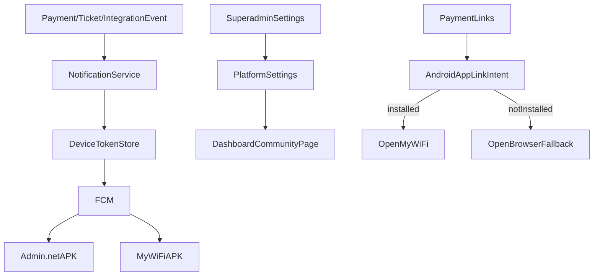

# Implement APK Linking, FCM Notifications, and Community Page

## Scope and Decisions
- Use **FCM push notification** as primary delivery channel for mobile apps.
- Payment links should prioritize opening **MyWiFi APK** when installed, and fall back to browser when not installed.
- Add **internal** Community page at `/dashboard/community` accessible by `superadmin`, `owner`, `admin`, `kolektor`, `teknisi`; content editable by superadmin.

## Workstreams

### 1) APK-first payment links with browser fallback
- Add Android app-link/deep-link handling for MyWiFi and Admin.net in Capacitor Android manifests and routing bootstrap.
- Introduce a shared helper for generating payment URLs that emits APK-first intent/app-link URL and browser fallback URL.
- Update existing payment entry points (notably portal/tagihan and message templates containing bayar links) to use the helper.
- Keep web behavior unchanged on non-Android devices.

**Primary files to touch**
- [src/app/portal/(app)/tagihan/page.tsx](src/app/portal/(app)/tagihan/page.tsx)
- [src/features/billing/tagihan-service.ts](src/features/billing/tagihan-service.ts)
- [src/features/messages/send.ts](src/features/messages/send.ts)
- [mobile/portal/android/app/src/main/AndroidManifest.xml](mobile/portal/android/app/src/main/AndroidManifest.xml)
- [mobile/admin/android/app/src/main/AndroidManifest.xml](mobile/admin/android/app/src/main/AndroidManifest.xml)

### 2) FCM notification foundation + event fanout
- Add DB tables for device tokens and notification logs (SQLite + PostgreSQL schemas + migration patch).
- Add server actions/API for device registration from mobile clients (token upsert + role/platform metadata).
- Add FCM sender service with retry/error logging.
- Trigger notifications for:
  - pembayaran sukses (admin + portal target)
  - error integrasi WhatsApp (admin target)
  - tiket gangguan baru/updated (teknisi + admin target)
- Add minimal in-app notification permission/request bootstrap for APK shell pages.

**Primary files to touch**
- [src/lib/db/schema.sqlite.ts](src/lib/db/schema.sqlite.ts)
- [src/lib/db/schema.pg.ts](src/lib/db/schema.pg.ts)
- [src/lib/db/schema-patches.ts](src/lib/db/schema-patches.ts)
- [src/features/billing/payment-service.ts](src/features/billing/payment-service.ts)
- [src/features/tickets/service.ts](src/features/tickets/service.ts)
- [src/lib/integrations/whatsapp/](src/lib/integrations/whatsapp/)
- [mobile/admin/package.json](mobile/admin/package.json)
- [mobile/portal/package.json](mobile/portal/package.json)

### 3) Internal Community page + superadmin editor
- Extend `platform_settings` with community content fields:
  - app description
  - donation QR image URL
  - APK download links (Admin.net, MyWiFi)
  - WhatsApp superadmin
  - Telegram group link
- Build `/dashboard/community` page rendering this content for staff roles.
- Add superadmin form section to edit these fields (reuse existing platform settings action pattern).
- Add dashboard navigation link for staff roles.

**Primary files to touch**
- [src/lib/db/schema.sqlite.ts](src/lib/db/schema.sqlite.ts)
- [src/lib/db/schema.pg.ts](src/lib/db/schema.pg.ts)
- [src/features/platform-settings/service.ts](src/features/platform-settings/service.ts)
- [src/features/platform-settings/actions.ts](src/features/platform-settings/actions.ts)
- [src/app/superadmin/pengaturan/](src/app/superadmin/pengaturan/)
- [src/app/isp/layout.tsx](src/app/isp/layout.tsx)
- [src/app/isp/community/page.tsx](src/app/isp/community/page.tsx)

## Validation and rollout
- Add focused tests/manual checks for:
  - deep-link open/fallback on Android device
  - notification delivery per event type/role
  - community page access control and content rendering
- Rebuild APKs after manifest/plugin updates.
- Run DB migration in production before enabling new features.

