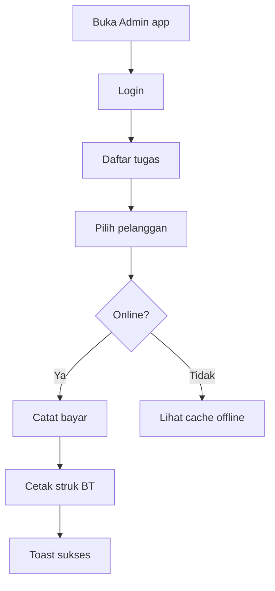
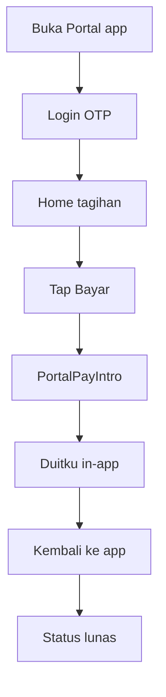

# Spesifikasi UI/UX — Aplikasi Android NetManage

**Versi:** 1.0  
**Tanggal:** 30 Juni 2026  
**Target viewport:** 360×800 (baseline), 390×844 (secondary)

Dokumen handoff desain → development. Implementasi di web Next.js (hybrid Capacitor), bukan native UI terpisah.

Terkaait: [prd-android-v1.md](prd-android-v1.md) · [android-ux-research.md](android-ux-research.md)

---

## 1. Design system

### 1.1 Token warna (reuse web)

Mengacu `src/app/globals.css` — **jangan** buat palet baru.

| Token | Light | Dark | Pemakaian |
|-------|-------|------|-----------|
| `--primary` | `hsl(221 83% 53%)` | `hsl(217 91% 60%)` | CTA primer, tab aktif |
| `--destructive` | merah | merah | Error, tunggakan |
| `--success` | hijau | hijau | Lunas, sukses bayar |
| `--warning` | amber | amber | Jatuh tempo dekat |
| `--muted-foreground` | abu | abu terang | Label sekunder |
| `--radius` | `0.625rem` | sama | Card, button |

### 1.2 Tipografi

| Elemen | Mobile | Weight |
|--------|--------|--------|
| Page title | 20px | semibold |
| Card title | 16px | medium |
| Body | 14px | normal |
| Caption / meta | 12px | normal, muted |
| Button | 14px | medium |

Font: mengikuti stack web (system-ui / sans existing).

### 1.3 Spacing & touch

| Token | Nilai | Catatan |
|-------|-------|---------|
| Page padding | 16px | horizontal |
| Card gap | 12px | antar kartu |
| Section gap | 24px | antar blok |
| Min touch target | 44×44 dp | button, tab, icon tap |
| Bottom nav height | 56dp + safe-area | fixed bottom |

### 1.4 Identitas dua app

| | NetManage Admin | NetManage Portal |
|---|-----------------|------------------|
| Tone | Operasional, padat | Ramah, sederhana |
| Ikon launcher | Logo + aksen dashboard | Logo + aksen rumah/WiFi |
| Splash background | `#2563eb` (primary) | `#2563eb` atau gradien lebih terang |
| Status bar | Primary gelap | Primary gelap |

---

## 2. Pola navigasi

### 2.1 Admin App — bottom navigation

**Owner / admin (4 item):**

```
[ Beranda ] [ Pelanggan ] [ Tagihan ] [ Menu ]
```

- **Menu** membuka drawer existing (`app-shell.tsx`) untuk rute lain: paket, router, tiket, pengaturan, dll.

**Kolektor (2 item):**

```
[ Tugas ] [ Profil / Keluar ]
```

**Teknisi (3 item):**

```
[ Tiket ] [ Beranda ] [ Menu ]
```

Implementasi: komponen baru `MobileBottomNav` — hanya tampil jika `display-mode: standalone` atau header `X-NetManage-App`.

### 2.2 Portal App — bottom navigation

```
[ Beranda ] [ Tagihan ] [ Lapor ] [ Akun ]
```

- **Akun**: info pelanggan, logout, link syarat & ketentuan.

### 2.3 Android back button

- Di root tab: konfirmasi keluar app ("Tekan lagi untuk keluar" atau dialog).
- Di form bayar / modal: back menutup modal dulu.
- Setelah redirect Duitku: deep link / URL return ke `/portal/tagihan?paid=1`.

---

## 3. Screen map & wireframe notes

### 3.1 Admin App

#### A1 — Login (`/login`)

```
┌─────────────────────────┐
│      [Logo NetManage]   │
│   Masuk ke Admin ISP    │
│  ┌───────────────────┐  │
│  │ Email             │  │
│  └───────────────────┘  │
│  ┌───────────────────┐  │
│  │ Password          │  │
│  └───────────────────┘  │
│  [      Masuk      ]    │
│  Error: superadmin →    │
│  "Gunakan web desktop"  │
└─────────────────────────┘
```

#### A2 — Dashboard home (`/dashboard`)

- Ringkasan kartu: pelanggan aktif, tagihan belum lunas, tiket open.
- Quick link ke halaman sering dipakai.

#### A3 — Pelanggan list (`/dashboard/pelanggan`)

**Card pattern (mobile):**

```
┌─────────────────────────┐
│ Budi Santoso    [Aktif] │
│ 0812xxx · Paket 20Mbps  │
│ Tagihan: Belum lunas    │
│        [ Detail ]       │
└─────────────────────────┘
```

- Search bar sticky top.
- Filter chip: Semua | Isolir | Belum lunas.

#### A4 — Tagihan list (`/dashboard/tagihan`)

- Tab client-side: Belum lunas | Tunggakan | Semua (existing `QueryTabNav`).
- Card per pelanggan + CTA Bayar / Detail.

#### A5 — Kolektor tugas (`/kolektor`)

```
┌─────────────────────────┐
│ Sort: [Terdekat▼]       │
├─────────────────────────┤
│ Siti Aminah      1.2 km │
│ Jl. Mawar No. 5         │
│ Tunggakan: Rp 150.000   │
│ [Maps] [Bayar] [Cetak]  │
├─────────────────────────┤
│ ...                     │
└─────────────────────────┘
```

- Offline banner kuning jika `navigator.onLine === false`.

#### A6 — Bayar tunai (modal)

- Pilihan: Bulan ini / Tunggakan / Keduanya.
- Tombol konfirmasi full-width di bawah (thumb zone).

### 3.2 Portal App

#### P1 — Login OTP (`/portal/login`)

- Input nomor WA besar (prefill jika magic link).
- Tombol **Kirim OTP** full-width.
- Countdown timer setelah kirim.

#### P2 — Home (`/portal`)

```
┌─────────────────────────┐
│ Halo, Budi              │
│ Paket: 20 Mbps · Aktif  │
├─────────────────────────┤
│ Tagihan Juni 2026       │
│ Rp 200.000 · Jatuh 28   │
│    [ Bayar Sekarang ]   │
└─────────────────────────┘
```

#### P3 — Bayar Duitku

- Pre-redirect screen: ilustrasi + teks "Anda akan diarahkan ke halaman pembayaran. Setelah selesai, kembali ke aplikasi."
- Tombol **Lanjutkan Pembayaran**.

#### P4 — Salah app (staf login di Portal)

- Full-screen info: "Akun staf tidak bisa digunakan di aplikasi Portal. Unduh NetManage Admin."

---

## 4. Komponen baru (spesifikasi dev)

### 4.1 `MobileBottomNav`

| Prop | Tipe | Keterangan |
|------|------|------------|
| `items` | `{ href, label, icon }[]` | max 4 |
| `activeHref` | string | dari pathname |

- Fixed bottom, `pb-safe` untuk notch.
- Sembunyikan di desktop (`md:hidden`) kecuali standalone PWA/app.

### 4.2 `MobileDataCard`

| Slot | Isi |
|------|-----|
| Header | Title + Badge |
| Body | 2–4 baris meta |
| Footer | 1–2 Button |

Ganti baris `TableRow` di breakpoint mobile.

### 4.3 `KolektorTaskCard`

| Field | Sumber data |
|-------|-------------|
| nama, alamat | pelanggan |
| jarak | haversine dari GPS kolektor |
| tunggakanTotal | `getTagihanSummary` |
| Actions | Maps link, PayTagihanPanel trigger, print |

### 4.4 `OfflineBanner`

- Tampil jika offline + role kolektor.
- Teks: "Mode offline — data terakhir diperbarui [jam]."

### 4.5 `PortalPayIntro`

- Screen/step sebelum `window.location` ke Duitku.
- Optional stepper: Tagihan → Bayar → Selesai.

---

## 5. States (wajib di mockup)

Setiap layar prioritas harus punya desain untuk:

| State | Contoh UI |
|-------|-----------|
| Loading | Skeleton card × 3 |
| Empty | Ilustrasi + "Belum ada data" + CTA |
| Error | Banner merah + retry |
| Offline | Banner kuning (kolektor) |
| Permission denied | GPS/BT dengan tombol ke Settings |
| Success | Toast hijau 3 detik |

---

## 6. User flows

### Kolektor — bayar di lapangan



### Portal — bayar mandiri



---

## 7. Asset native shell

| Asset | Ukuran | Admin | Portal |
|-------|--------|-------|--------|
| Adaptive icon fg | 108×108 dp | logo + badge admin | logo + badge portal |
| Adaptive icon bg | — | `#2563eb` | `#2563eb` |
| Splash | 2732×2732 | logo centered | logo + tagline pelanggan |
| Play Store feature | 1024×500 | screenshot composite | screenshot composite |

Folder export: `docs/design/android/` (Figma/PNG) → `mobile/*/assets/` saat implementasi.

---

## 8. Breakpoints & implementasi

| Breakpoint | Perilaku |
|------------|----------|
| `< 768px` | Card view, bottom nav, hide sidebar default |
| `>= 768px` | Layout desktop existing (web browser) |
| `standalone` | Bottom nav selalu; status bar themed |

Deteksi app shell:

```ts
// contoh
const isMobileApp = headers().get("x-netmanage-app") === "admin"
  || window.matchMedia("(display-mode: standalone)").matches;
```

---

## 9. Checklist sign-off desain

| # | Item | Status |
|---|------|--------|
| 1 | Screen map 20 layar disetujui | Done (lihat wireframes) |
| 2 | Wireframe low-fi direview | **Approved** — [REVIEW-NOTES.md](design/android/wireframes/REVIEW-NOTES.md) |
| 3 | Mockup hi-fi 360×800 (Figma) | Deferred (opsional) |
| 4 | Dark mode dicek | Pending |
| 5 | Walkthrough dengan 1 owner + 1 kolektor | Pending |
| 6 | Handoff ke dev (dokumen ini + Figma link) | Pending |

**Sign-off:**

| Peran | Nama | Tanggal |
|-------|------|---------|
| Product | | |
| Desain | | |
| Development | | |

---

## 10. Folder desain visual

Wireframe dan mockup disimpan di:

- [design/android/wireframes/SCREEN-WIREFRAMES.md](design/android/wireframes/SCREEN-WIREFRAMES.md) — **wireframe ASCII detail per layar (starting point)**
- [design/android/mockups/](design/android/mockups/) — hi-fi Figma/PNG (belum dibuat)

_(Mockup hi-fi mengacu wireframe di atas + token §1.)_
