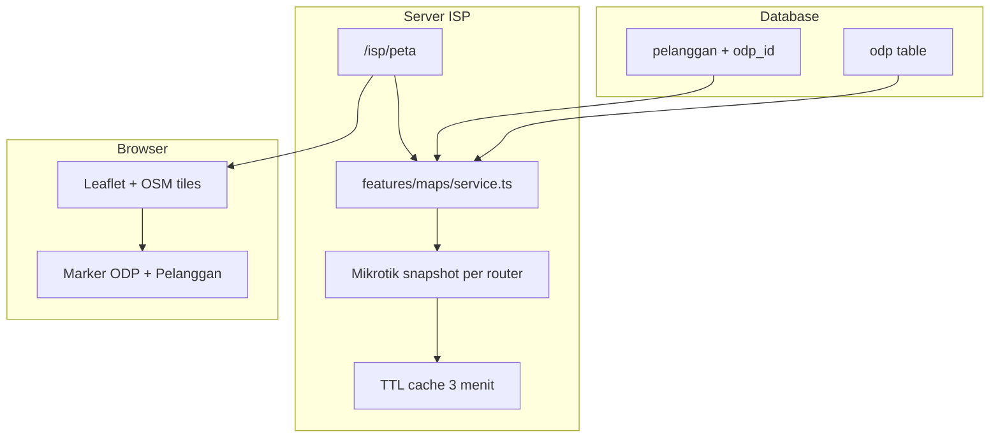

# Rencana Menu Peta ISP (ODP + Pelanggan + Status Modem)

> Menambah menu **Peta** di ISP (`/isp/peta`) dengan manajemen ODP, marker pelanggan terhubung ODP, status modem dari Mikrotik (aktif/isolir/gangguan), dan renderer peta berbasis Leaflet + OpenStreetMap agar tidak memakai Google Maps API berbayar.

**Status:** Implemented  
**Akses menu:** Owner, Admin, Teknisi  
**Status gangguan:** Dari Mikrotik (PPP secret vs active connection), bukan dari tiket

---

## Checklist implementasi

- [x] Tambah tabel `odp` + `pelanggan.odp_id` / `odp_port` di `schema.ts` dan `ensure-schema.ts`
- [x] Buat `features/odp` (service + actions) dan UI CRUD ODP di tab/halaman peta
- [x] Perluas `MikrotikClient` dengan `snapshotConnections` + resolver status aktif/isolir/gangguan + cache TTL
- [x] Buat `features/maps/service.ts` agregator data marker ODP + pelanggan + status modem
- [x] Implement `/isp/peta` dengan Leaflet+OSM, marker cluster, filter, legenda, refresh status
- [x] Integrasi dropdown ODP di `pelanggan-fields` + validasi kapasitas port
- [x] Komponen `MapPinPicker` (klik peta / GPS) untuk ODP dan pelanggan — tanpa input angka manual
- [x] Tambah menu Peta di `app-shell`, env `MAP_TILE_URL` + `MAP_MODEM_CACHE_SECONDS`, update seed demo

---

## Konteks codebase saat ini

- Koordinat pelanggan sudah ada: `pelanggan.latitude`, `pelanggan.longitude` di `src/lib/db/schema.ts`
- Navigasi kolektor/pelanggan pakai **URL eksternal Google Maps** (gratis, tanpa API key) via `src/lib/integrations/maps/mock.ts`
- **ODP belum ada** di schema/UI (hanya disebut di PRD)
- Mikrotik sudah bisa baca `/ppp/secret` dan `/ppp/active` (REST) / equivalent legacy — dipakai sebagian di `src/lib/integrations/mikrotik/rest.ts` tapi belum diekspos untuk status per-pelanggan
- Akses menu: **Owner, Admin, Teknisi**

## Arsitektur target



## 1. Schema database: ODP + relasi pelanggan

Tambah tabel `odp` di `src/lib/db/schema.ts`:

### Identitas & lokasi

| Kolom | Tipe | Keterangan |
|-------|------|------------|
| `id` | text PK | ID internal sistem (mis. `odp_xxx`) |
| `tenant_id` | FK tenant | |
| `kode` | text | **ID ODP** — nama/nomor yang dipakai operator (mis. `ODP-001`, `RT05-12`); **unik per tenant** |
| `nama` | text nullable | Label lokasi / keterangan singkat (mis. "Depan masjid") |
| `latitude`, `longitude` | real | dari MapPinPicker; wajib agar tampil di peta |
| `catatan` | text nullable | catatan teknisi |
| `is_active` | boolean | nonaktif = tidak tampil di peta default |

### Splitter & redaman (detail teknis ODP)

| Kolom | Tipe | Keterangan |
|-------|------|------------|
| `splitter_rasio` | text nullable | Rasio splitter (contoh **`10:90`**) — proporsi cabang : lanjut |
| `redaman_input_db` | real nullable | Redaman **input** (dB), contoh `-20.5` |
| `redaman_output_db` | real nullable | Redaman **output** (dB), contoh `-23.2` |
| `splitter_pasif` | text nullable | Splitter pasif (contoh **`1:8`**, `1:4`, `1:16`) — jumlah port cabang |

**Hubungan splitter pasif ↔ kapasitas port:**

| `splitter_pasif` | Port maksimum (default) |
|------------------|-------------------------|
| `1:2` | 2 |
| `1:4` | 4 |
| `1:8` | 8 |
| `1:16` | 16 |
| `1:32` | 32 |

| Kolom | Tipe | Keterangan |
|-------|------|------------|
| `kapasitas_port` | integer | Default **auto** dari `splitter_pasif`; boleh di-override manual jika lapangan beda |

Validasi form:

- `kode` wajib, unik per tenant
- `splitter_pasif` opsional; jika diisi format `1:N` (N bilangan bulat ≥ 2)
- `splitter_rasio` opsional; format bebas teks pendek (contoh `10:90`, `5:95`)
- `redaman_input_db` / `redaman_output_db` opsional; angka desimal (dB)

### Relasi pelanggan

Tambah pada `pelanggan`:

- `odp_id` → FK `odp.id` (nullable)
- `odp_port` → text nullable (nomor port di ODP, mis. `P3` / `3`)

Patch idempotent di `src/lib/db/ensure-schema.ts` + seed demo 2–3 ODP di `src/lib/db/seed.ts` (dengan contoh `kode`, `splitter_pasif: "1:8"`, `splitter_rasio: "10:90"`, redaman sample).

**Aturan bisnis:**

- Satu pelanggan maksimal satu ODP
- `portTerpakai` = jumlah pelanggan terhubung; tidak boleh melebihi `kapasitas_port`
- Popup/detail ODP di peta menampilkan: ID (`kode`), splitter pasif, rasio, redaman in/out, port terpakai

## Penentuan koordinat ODP & pelanggan (bukan input angka manual)

**Saat ini di aplikasi:** form pelanggan masih pakai input angka `latitude` / `longitude` manual — ini akan **diganti** pada implementasi fitur peta.

**Yang direncanakan (MVP Fase B):**

| Cara | ODP | Pelanggan | Biaya API |
|------|-----|-----------|-----------|
| **Klik titik di peta** (utama) | Ya — mode "Tambah ODP" / edit: klik peta → lat/lng terisi otomatis | Ya — mini-map di form pelanggan atau drag marker | Gratis (Leaflet+OSM) |
| **GPS perangkat** (opsional) | Tombol "Lokasi saya" saat survey lapangan | Tombol "Ambil lokasi saat ini" (teknisi di lokasi pelanggan) | Gratis (`navigator.geolocation`) |
| **Seret marker** | Edit posisi ODP dengan drag | Edit posisi pelanggan dengan drag | Gratis |
| Input angka lat/lng | **Disembunyikan** (advanced/collapse only) | **Disembunyikan** (advanced/collapse only) | — |
| Geocoding alamat → koordinat | **Tidak** (hindari Google Geocoding / biaya token) | **Tidak** | — |

**Alur UX yang diusulkan:**

1. **ODP** — Tab ODP → "Tambah ODP" → peta fokus → user **klik sekali** di lokasi ODP → form terisi koordinat + marker preview → simpan.
2. **Pelanggan** — Form tambah/edit pelanggan → section "Lokasi" dengan mini-map → **klik peta** atau **GPS** → koordinat tersimpan; field angka tidak perlu diketik operator.
3. **Tanpa koordinat** — pelanggan/ODP tetap bisa disimpan tanpa titik; tidak muncul di peta sampai koordinat di-set.

**Bukan "otomatis penuh":** sistem **tidak** menebak koordinat dari alamat teks atau dari ODP terdekat tanpa aksi user. Titik ditentukan oleh **klik peta** atau **GPS**, bukan mengetik `-6.2`, `106.8`.

Komponen bersama: `src/components/maps/map-pin-picker.tsx` (reuse di form ODP, form pelanggan, dan halaman `/isp/peta`).

## 2. CRUD ODP (Owner/Admin/Teknisi)

Feature module baru `src/features/odp/`:

- `service.ts` — list/create/update/delete ODP, hitung `portTerpakai`
- `actions.ts` — server actions + validasi tenant

UI (bisa 2 tab dalam satu halaman peta):

- **Tab Peta** — visualisasi
- **Tab ODP** — tabel CRUD + form detail

**Form ODP (field):**

| Field UI | Kolom DB | Contoh |
|----------|----------|--------|
| ID ODP | `kode` | `ODP-001`, `BLok-A-12` |
| Nama lokasi | `nama` | "Gang depan RT 05" |
| Splitter pasif | `splitter_pasif` | `1:8` (select: 1:2, 1:4, 1:8, 1:16, 1:32) |
| Rasio splitter | `splitter_rasio` | `10:90` |
| Redaman input (dB) | `redaman_input_db` | `-20.5` |
| Redaman output (dB) | `redaman_output_db` | `-23.2` |
| Kapasitas port | `kapasitas_port` | auto dari splitter pasif, editable |
| Lokasi | `latitude`, `longitude` | MapPinPicker |
| Catatan | `catatan` | teks bebas |

Form ODP: **MapPinPicker** — klik peta atau GPS untuk set koordinat; input angka lat/lng hanya di bagian advanced (opsional).

Tabel ODP menampilkan: ID, splitter pasif, rasio, port terpakai/kapasitas, status aktif.

## 3. Status modem pelanggan (dari Mikrotik)

Perluas kontrak `src/lib/integrations/mikrotik/types.ts`:

```typescript
type ModemMapStatus = "aktif" | "isolir" | "gangguan" | "unknown";

interface ConnectionSnapshot {
  username: string;
  disabled: boolean;
  isOnline: boolean; // ada di ppp/active atau hotspot/active
}
```

Method baru di `MikrotikClient`:

- `snapshotConnections(router, type: "pppoe" | "hotspot")` — **1–2 call per router**, bukan per pelanggan

Implementasi:

- REST: `GET /ppp/secret` + `GET /ppp/active` (hotspot: `/ip/hotspot/user` + `/ip/hotspot/active`)
- Legacy: `/ppp/secret/print` + `/ppp/active/print`
- Mock: simulasi deterministik dari `connectionUsername` + `isIsolated`

**Logika status per pelanggan** (PPPoE; hotspot analog):

| Kondisi | Status peta |
|---------|-------------|
| `isIsolated` DB **atau** secret `disabled=true` | **isolir** (merah) |
| secret aktif **dan** username ada di active session | **aktif** (hijau) |
| secret aktif **tapi** tidak ada di active session | **gangguan** (kuning/orange) |
| tidak ada router/username / router offline | **unknown** (abu) |

Prioritas: `isolir` > `aktif` > `gangguan` > `unknown`.

Service agregator `src/features/maps/service.ts`:

- Ambil semua pelanggan tenant (+ join ODP, router)
- Group by `routerId` → panggil snapshot Mikrotik sekali per router
- Merge ke struktur marker `{ id, nama, lat, lng, odpId, modemStatus, ... }`

**Caching (penting untuk performa & beban router):**

- In-memory cache per `tenantId+routerId` TTL **3 menit** (env `MAP_MODEM_CACHE_SECONDS`)
- Tombol **Refresh Status** di halaman peta (manual), bukan auto-polling agresif
- Jika `MIKROTIK_DRIVER=mock`, status tetap konsisten untuk dev

## 4. Menu Peta ISP — minim biaya Google Maps

**Keputusan teknologi:** **Leaflet + OpenStreetMap tiles** — **tidak** memakai Google Maps JavaScript API, Places, Geocoding, Distance Matrix, atau Static Maps.

| Kebutuhan | Solusi | Biaya API |
|-----------|--------|-----------|
| Tampil peta interaktif | Leaflet + tile OSM (`{s}.tile.openstreetmap.org`) | Gratis* |
| Marker ODP & pelanggan | GeoJSON dari DB | Gratis |
| Warna status modem | CSS/divIcon Leaflet | Gratis |
| Navigasi ke lokasi | Tetap link eksternal `maps.google.com/dir` (sudah ada) | Gratis |
| Jarak kolektor | Tetap haversine client-side | Gratis |

\*OSM tiles: gunakan dengan fair-use; untuk produksi skala besar pertimbangkan tile provider gratis tier (MapTiler/Stadia) via env `NEXT_PUBLIC_MAP_TILE_URL` — tetap **bukan** Google.

**Implementasi UI** `src/app/isp/peta/page.tsx`:

- Server component: load data ODP + pelanggan + status modem (cached)
- Client component `map-canvas.tsx` dengan `dynamic(() => import(...), { ssr: false })` — hindari SSR Leaflet
- Marker cluster (`leaflet.markercluster`) untuk banyak pelanggan
- Legenda: Aktif / Isolir / Gangguan / Unknown
- Filter: status, ODP, router
- Popup pelanggan: nama, status, ODP, link ke `/isp/pelanggan/[id]`, tombol Navigasi
- Popup ODP: **ID (`kode`)**, splitter pasif, rasio, redaman in/out (dB), kapasitas/port terpakai, daftar pelanggan terhubung

**Navigasi menu** — tambah di `src/components/layout/app-shell.tsx`:

```typescript
{ href: "/isp/peta", label: "Peta", icon: Map }
```

Akses: owner, admin, teknisi (sama seperti layout ISP).

## 5. Integrasi pelanggan ↔ ODP

Perbarui `src/features/customers/components/pelanggan-fields.tsx`:

- Dropdown **ODP** (opsional) + input port
- Ganti input angka lat/lng dengan **MapPinPicker** (klik mini-map + tombol GPS)
- Validasi: ODP harus tenant yang sama; cek kapasitas sebelum assign

Perbarui `src/features/customers/service.ts` create/update.

**Catatan:** koordinat pelanggan yang sudah ada di DB tetap tampil sebagai marker; edit posisi via drag/klik di picker.

## 6. Dependensi npm

Tambah ke `package.json`:

- `leaflet`
- `react-leaflet@4` (React 19 compatible check saat implement)
- `@types/leaflet`
- `leaflet.markercluster` + types

Import CSS Leaflet di client component saja (bukan global) agar tidak memengaruhi halaman lain.

**Tidak menambah:** `@googlemaps/js-api-loader`, Mapbox GL (kecuali diminta later).

Env `.env.example`:

```env
# Peta ISP — tile gratis OSM (default). Ganti jika pakai provider tile sendiri.
NEXT_PUBLIC_MAP_TILE_URL=https://{s}.tile.openstreetmap.org/{z}/{x}/{y}.png
MAP_MODEM_CACHE_SECONDS=180
# NEXT_PUBLIC_MAPS_API_KEY tetap opsional/kosong — tidak dipakai fitur peta ini
```

## 7. Keamanan & hak akses

- Semua query/filter **`tenantId`** dari session
- Route `/isp/peta` — `requireUser(["owner", "admin", "teknisi"])`
- Snapshot Mikrotik hanya untuk router milik tenant yang sama
- Kolektor **tidak** dapat menu peta penuh; tetap pakai navigasi di tugas penagihan

## 8. Urutan implementasi (fase)

### Fase A — Foundation (wajib)

1. Schema ODP + `pelanggan.odp_id` + ensure-schema
2. Feature ODP CRUD
3. Mikrotik `snapshotConnections` + resolver status modem + cache
4. `features/maps/service.ts` agregator data peta

### Fase B — UI Peta (wajib)

5. Halaman `/isp/peta` + Leaflet map + marker/filter/legenda
6. Komponen **MapPinPicker** + integrasi form ODP & form pelanggan (klik peta / GPS, bukan ketik angka)
7. Nav menu + integrasi dropdown ODP di form pelanggan

### Fase C — Polish (opsional setelah MVP)

8. Pin koordinat langsung dari halaman peta utama (edit posisi marker in-place)
9. Export daftar pelanggan per ODP
10. Refactor kolektor `kolektor-tasks.tsx` pakai shared `navigationUrl` helper (bukan Google API)

## 9. Verifikasi / test plan

- Buat 2 ODP + assign pelanggan → marker ODP & pelanggan muncul, garis visual opsional (popup saja cukup MVP)
- Pelanggan isolir di billing → marker merah (DB `isIsolated`)
- Pelanggan PPPoE secret enabled tapi tidak di `/ppp/active` → marker **gangguan**
- Pelanggan online di `/ppp/active` → marker **aktif**
- Refresh status: tidak memanggil Mikrotik lebih dari 1x per router per 3 menit
- **Network tab:** tidak ada request ke `maps.googleapis.com/maps/api/js` saat buka `/isp/peta`
- Deploy: `npm run db:ensure-schema` + `npm run build`

## Risiko & mitigasi

| Risiko | Mitigasi |
|--------|----------|
| Banyak pelanggan → lambat load Mikrotik | Batch per router + cache TTL + tombol refresh manual |
| Hotspot-only router | Branch snapshot hotspot vs pppoe by `paket.tipe` / `connectionType` |
| OSM tile rate limit | Env tile URL configurable; dokumentasi alternatif provider |
| Leaflet + Next.js SSR | Dynamic import `ssr: false` |
