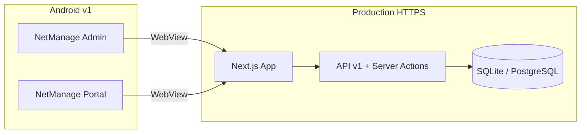

# PRD — Aplikasi Android NetManage v1

**Versi dokumen:** 1.0  
**Tanggal:** 30 Juni 2026  
**Baseline web:** release `v1.0.0` (tag GitHub)  
**Status:** Draft — siap review stakeholder

Dokumen ini melengkapi [PRD utama NetManage SaaS](../Product%20Requirements%20Document%20(PRD)%20%E2%80%94%20NetManage%20SaaS.md) khusus untuk **dua aplikasi Android** terpisah.

Dokumen terkait:

- [Rencana teknis hybrid](android-app-plan.md)
- [Spesifikasi UI/UX](android-ui-ux-spec.md)
- [Riset UX](android-ux-research.md)
- [Checklist QA](android-qa-checklist.md)

---

## 1. Executive summary

### Masalah

- Kolektor penagihan butuh akses mobile di lapangan (GPS, bayar tunai, cetak struk) tanpa membuka browser manual.
- Pelanggan butuh cara mudah cek tagihan dan bayar dari HP.
- Web app v1.0.0 sudah lengkap di desktop, tetapi pengalaman mobile belum dioptimalkan untuk operasional harian.

### Solusi

Dua APK **hybrid** (Capacitor + WebView HTTPS) yang membungkus UI web existing:

| Aplikasi | Package (contoh) | Persona |
|----------|------------------|---------|
| **NetManage Admin** | `id.tunnelhost.netmanage.admin` | owner, admin, kolektor, teknisi |
| **NetManage Portal** | `id.tunnelhost.netmanage.portal` | pelanggan |

### Out of scope v1

- Superadmin di app mobile (tetap web desktop)
- React Native / rewrite native penuh
- Multi-URL per tenant (satu server platform per deploy)
- Push notification (fase berikutnya)

### Distribusi

1. **Fase 1:** APK sideload / internal (ISP install manual)
2. **Fase 2:** Google Play Store (AAB + listing)

---

## 2. Persona & user stories

### NetManage Admin

| Persona | User story (MVP) | Prioritas |
|---------|------------------|-----------|
| Owner / admin | Sebagai owner, saya ingin melihat ringkasan pelanggan & tagihan dari HP agar bisa memantau operasional di luar kantor. | Must |
| Owner / admin | Sebagai admin, saya ingin mencari pelanggan dan melihat status tagihan tanpa scroll tabel horizontal. | Must |
| Kolektor | Sebagai kolektor, saya ingin melihat daftar pelanggan menunggak di area saya, diurutkan jarak terdekat. | Must |
| Kolektor | Sebagai kolektor, saya ingin mencatat pembayaran tunai dan mencetak struk Bluetooth di lokasi. | Must |
| Kolektor | Sebagai kolektor, saya ingin tetap melihat daftar tugas saat sinyal lemah (cache offline dasar). | Should |
| Teknisi | Sebagai teknisi, saya ingin melihat dan memperbarui status tiket gangguan dari HP. | Should |

### NetManage Portal

| Persona | User story (MVP) | Prioritas |
|---------|------------------|-----------|
| Pelanggan | Sebagai pelanggan, saya ingin login dengan OTP WhatsApp tanpa mengingat password. | Must |
| Pelanggan | Sebagai pelanggan, saya ingin melihat tagihan aktif dan riwayat pembayaran. | Must |
| Pelanggan | Sebagai pelanggan, saya ingin membayar via Duitku (QRIS/VA) dari HP. | Must |
| Pelanggan | Sebagai pelanggan, saya ingin melaporkan gangguan dengan foto. | Should |
| Pelanggan | Sebagai pelanggan, saya ingin menjalankan diagnostik koneksi sederhana. | Could |

---

## 3. Functional requirements

| ID | Requirement | Admin | Portal | Prioritas |
|----|-------------|:-----:|:------:|-----------|
| F1 | Login & session cookie persist (`nm_session`) | Ya | Ya | Must |
| F2 | Entry URL: `/login` vs `/portal/login` | Ya | Ya | Must |
| F3 | Tolak login superadmin di Admin app | Ya | — | Must |
| F4 | Tolak login staf di Portal app (arahkan ke Admin) | — | Ya | Must |
| F5 | GPS + navigasi Maps/Waze ke pelanggan | Ya | — | Must |
| F6 | Cetak struk thermal Bluetooth | Ya | — | Must |
| F7 | Offline cache daftar tugas kolektor | Ya | — | Should |
| F8 | Pembayaran Duitku (redirect in-app browser) | — | Ya | Must |
| F9 | Upload foto laporan gangguan | — | Ya | Should |
| F10 | Push notification | — | — | Won't (v1) |

---

## 4. Non-functional requirements

| Aspek | Spesifikasi |
|-------|-------------|
| Platform | Android 8+ (API 26), target API 34 |
| Keamanan | HTTPS wajib; cookie `Secure` di production |
| Ukuran APK | < 15 MB (shell tipis; konten dari server) |
| Bahasa | Indonesia |
| Performa | First meaningful paint < 3 detik di 4G (setelah warm cache) |
| Aksesibilitas | Kontras WCAG AA untuk teks utama; touch target min 44 dp |

---

## 5. Arsitektur



### Pendekatan hybrid

- **Capacitor** membungkus WebView ke `https://isp.tunnelhost.my.id` (atau domain deploy tenant platform).
- **Tidak perlu** backend baru untuk MVP — auth via cookie + Server Actions existing.
- Header kustom `X-NetManage-App: admin | portal` dari shell Capacitor untuk guard role.

### Struktur repo (rencana)

```
mobile/
  admin/     # Capacitor — com.netmanage.admin
  portal/    # Capacitor — com.netmanage.portal
```

---

## 6. Gap analysis — web v1.0.0

| Area | Status web | Perlu untuk Android v1 |
|------|------------|------------------------|
| PWA manifest | Ada, icon kecil | Icon 512, manifest per app |
| Service worker | Dasar (`/kolektor`, `/offline`) | Perluas cache + API mobile |
| Kolektor UI | Card list, bayar tunai | GPS sort, UX mobile, offline |
| Bluetooth print | Web Bluetooth API | Uji WebView Android |
| Portal | OTP, tagihan, Duitku | Viewport, redirect Duitku |
| ISP dashboard | Banyak tabel | Card view mobile |
| Superadmin | `/superadmin` | Exclude dari Admin APK |

Detail riset: [android-ux-research.md](android-ux-research.md)

---

## 7. Roadmap implementasi

| Fase | Isi | Estimasi | Output |
|------|-----|----------|--------|
| 0a | PRD (dokumen ini) | 1–2 hari | PRD signed off |
| 0b | Desain UI/UX | 4–6 hari | Mockup + spec |
| 1 | Web mobile hardening | 4–6 hari | UI siap dibungkus |
| 2 | Capacitor dual app | 2–3 hari | 2 APK internal |
| 3 | QA device | 2–3 hari | Laporan QA |
| 4 | Distribusi internal | 1 hari | Link download APK |
| 5 | Play Store | 3–5 hari | Listing live |

**MVP APK internal:** ~3 minggu setelah PRD + desain disetujui.

---

## 8. Risiko

| Risiko | Dampak | Mitigasi |
|--------|--------|----------|
| Web Bluetooth gagal di WebView | Kolektor tidak bisa cetak | Uji minggu 1; plugin Capacitor v1.1 |
| Play Store tolak thin WebView | Listing ditolak | Offline kolektor, splash, deep link |
| Duitku putus session | Bayar gagal / bingung user | Custom Tabs + instruksi kembali |
| GPS ditolak | Sort jarak tidak jalan | Fallback sort nama/manual |

---

## 9. Acceptance criteria (rilis v1)

- [ ] Dua APK terinstall dan login berhasil per persona
- [ ] Superadmin ditolak di Admin app
- [ ] Staf ditolak / diarahkan di Portal app
- [ ] Kolektor: list tugas, bayar tunai, navigasi GPS
- [ ] Portal: OTP, tagihan, bayar Duitku end-to-end
- [ ] Session persist setelah tutup app
- [ ] QA checklist [android-qa-checklist.md](android-qa-checklist.md) lulus di 3+ device

---

## 10. Sign-off

| Peran | Nama | Tanggal | Status |
|-------|------|---------|--------|
| Product owner | | | Pending |
| Tech lead | | | Pending |
| UX / desain | | | Pending |
