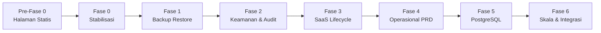
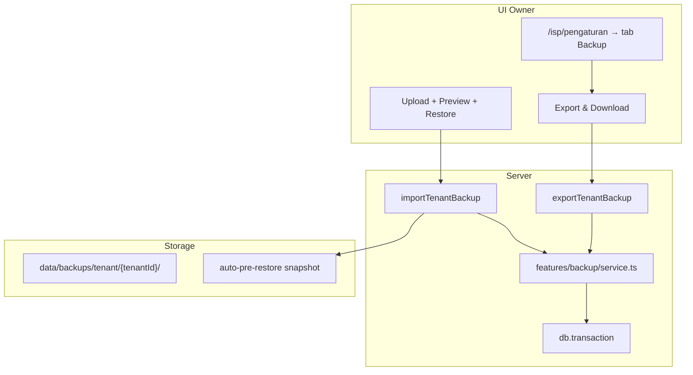

# Roadmap Implementasi NetManage — Urutan Fokus Kerja

> Rencana berurutan untuk pengembangan NetManage dari MVP ke production-grade, termasuk **Backup & Restore** agar ISP bisa mengelola dan melindungi datanya sendiri.

**Status:** Draft — siap dieksekusi per fase  
**Branch disarankan:** satu fase = satu branch (`feat/backup-restore`, `feat/audit-log`, dst.)  
**Prinsip:** selesaikan satu fase → deploy → uji production → baru lanjut fase berikutnya.

---

## Cara pakai dokumen ini

1. Kerjakan **Pre-Fase 0** dulu (halaman statis platform).
2. Lanjut **Fase 0** (stabilisasi deploy yang sudah ada).
3. **Fase 1 (Backup & Restore)** — jadikan safety net sebelum migrasi DB atau fitur besar lain.
4. Jangan loncat ke Fase 5 (PostgreSQL) sebelum Fase 1–3 selesai.
5. Centang checklist di setiap fase saat selesai.



| Fase | Fokus | Estimasi | Risiko jika dilewati |
|------|--------|----------|----------------------|
| **Pre-0** | Halaman statis + editor superadmin | 0.5–1 hari | Situs tanpa Tentang/Kontak/T&C |
| 0 | Stabilisasi production | 0.5 hari | Bug deploy / schema error |
| 1 | **Backup & Restore ISP** | 2–3 hari | Kehilangan data saat update |
| 2 | Keamanan & audit log | 2 hari | Password router bocor, tidak ada jejak |
| 3 | Langganan SaaS otomatis | 1 hari | Tenant expired tetap aktif |
| 4 | Gap PRD operasional | 4–5 hari | Kolektor offline, tiket tanpa foto |
| 5 | Migrasi PostgreSQL | 1–2 hari | SQLite lock di skala besar |
| 6 | API & skala lanjutan | 3+ hari | Integrasi pihak ketiga terbatas |

---

## Pre-Fase 0 — Halaman statis platform (Tentang, Kontak, T&C)

**Tujuan:** Halaman publik yang bisa diedit superadmin sebelum stabilisasi production.

**Status:** Implemented

### Checklist

- [x] Tabel `platform_settings` (singleton) di schema + `ensure-schema`
- [x] Halaman publik: `/tentang`, `/kontak` (tombol WhatsApp), `/syarat-ketentuan`
- [x] Submenu Pengaturan (klik expand): Profil App, Logo Brand, Pemilik, Alamat, Halaman Statis
- [x] Brand platform editable (ganti NetManage) — homepage, title browser, footer, superadmin sidebar
- [x] Link footer di semua halaman publik & auth
- [x] Menu Pengaturan di sidebar superadmin

### File utama

| Path | Fungsi |
|------|--------|
| `src/lib/db/schema.ts` | Tabel `platform_settings` |
| `src/features/platform-settings/` | Service, actions, defaults, WhatsApp helper |
| `src/app/tentang/page.tsx` | Halaman Tentang |
| `src/app/kontak/page.tsx` | Halaman Kontak + wa.me |
| `src/app/syarat-ketentuan/page.tsx` | Syarat & Ketentuan |
| `src/app/superadmin/pengaturan/` | Layout Pengaturan + sub-nav |
| `src/app/superadmin/pengaturan/halaman-statis/` | Form editor halaman statis |

### Deploy

```bash
npm run db:ensure-schema
npm run build
pm2 restart billingisp
```

### Selesai jika

Superadmin bisa edit teks → simpan → halaman publik langsung berubah; tombol WhatsApp di `/kontak` membuka chat.

---

## Fase 0 — Stabilisasi production (selesaikan dulu)

**Tujuan:** Pastikan build saat ini stabil di VPS sebelum menambah fitur.

### Checklist

- [ ] `git pull` + `npm ci` + `npm run db:ensure-schema` + `npm run build` + `pm2 restart billingisp`
- [ ] Smoke test: login owner, pelanggan, kolektor, portal OTP, `/isp/peta`, cron billing (`curl .../api/cron`)
- [ ] Backup manual file DB sekali (`cp netmanage.db netmanage.db.manual.bak`)
- [ ] Dokumentasi env production lengkap (Duitku, WA, `CRON_SECRET`, `MAP_MODEM_CACHE_SECONDS`)

### Selesai jika

Semua menu utama bisa diakses tanpa error 500; cron billing jalan; peta tidak spam error Mikrotik offline.

---

## Fase 1 — Backup & Restore data ISP ⭐ (prioritas Anda)

**Tujuan:** Owner/admin ISP bisa **export**, **download**, dan **restore** data bisnis mereka tanpa akses SSH ke server.

### 1.1 Ruang lingkup data

#### Export per tenant (untuk ISP — menu Pengaturan)

| Termasuk | Tidak termasuk |
|----------|----------------|
| Profil tenant (nama, logo, tema) | Session login |
| Staf tenant (user dengan `tenantId`) | OTP pelanggan |
| Router, paket internet, ODP | Data tenant lain |
| Pelanggan, invoice, tiket + assignment | Paket SaaS platform (`package_tenant`) |
| Pengeluaran + kategori | Superadmin |
| Konfig integrasi Duitku/WA (encrypted) | Log pembayaran platform subscription* |

\* Log subscription platform bisa di-exclude atau di-mask — keputusan: **exclude** dari export ISP (hanya data operasional ISP).

#### Backup penuh platform (superadmin saja)

- Snapshot file SQLite via `better-sqlite3` `.backup()` → download `.db` atau `.zip`
- Opsional: cron server harian ke folder `backups/` (retention 7 hari)

### 1.2 Format file backup tenant

```json
{
  "format": "netmanage-tenant-backup",
  "version": 1,
  "exportedAt": "2026-06-18T10:00:00.000Z",
  "tenantId": "ten_xxx",
  "tenantDomain": "demo.net",
  "appVersion": "0.1.0",
  "counts": {
    "pelanggan": 120,
    "invoice": 450,
    "router": 2
  },
  "data": {
    "tenant": { },
    "users": [ ],
    "routers": [ ],
    "paketInternet": [ ],
    "odp": [ ],
    "pelanggan": [ ],
    "invoices": [ ],
    "tickets": [ ],
    "ticketAssignments": [ ],
    "kategoriPengeluaran": [ ],
    "pengeluaran": [ ],
    "tenantDuitkuConfig": { },
    "tenantWhatsAppConfig": { }
  }
}
```

- Ekstensi file: `.netmanage.json` atau `.netmanage.json.gz` (gzip untuk ISP besar)
- Validasi schema version saat import; tolak file versi tidak dikenal

### 1.3 Mode restore

| Mode | Perilaku | UI label |
|------|----------|----------|
| **Preview** | Tampilkan ringkasan (jumlah record, tanggal export) tanpa menulis DB | "Pratinjau" |
| **Merge** | Insert record baru; skip jika ID sudah ada | "Gabungkan" |
| **Replace** | Hapus semua data tenant saat ini → import dari file | "Ganti semua data" |

**Replace** wajib:
- Konfirmasi ketik nama usaha
- Hanya role **owner**
- Backup otomatis tenant saat ini sebelum replace (simpan ke disk server + tawarkan download)

**Urutan import (foreign key):**
`users` → `routers` → `paketInternet` → `odp` (topologi: router dulu, ODP parent setelah child-less) → `pelanggan` → `invoices` → `kategoriPengeluaran` → `pengeluaran` → `tickets` → `ticketAssignments` → config integrasi

### 1.4 Arsitektur teknis



### 1.5 File & modul yang dibuat

| Path | Fungsi |
|------|--------|
| `src/features/backup/types.ts` | Tipe format backup, mode restore |
| `src/features/backup/tables.ts` | Daftar tabel per tenant + urutan FK |
| `src/features/backup/export.ts` | Query & serialize JSON |
| `src/features/backup/import.ts` | Validasi, preview, merge/replace |
| `src/features/backup/actions.ts` | Server actions (owner/superadmin) |
| `src/app/isp/pengaturan/backup-panel.tsx` | UI export/import |
| `src/app/superadmin/backup/page.tsx` | Backup full DB (superadmin) |
| `scripts/backup-tenant.ts` | CLI: `npm run backup:tenant -- --tenant-id=...` |
| `scripts/backup-full.ts` | CLI: `npm run backup:full` |
| `data/backups/.gitkeep` | Folder backup server (gitignore) |

### 1.6 UI Pengaturan ISP

Tab baru **"Backup & Restore"** di `/isp/pengaturan`:

1. **Export data**
   - Tombol "Unduh backup"
   - Info: jumlah pelanggan, invoice, tanggal terakhir export
2. **Restore data**
   - Upload file `.netmanage.json` / `.json.gz`
   - Pratinjau → pilih Merge atau Replace
   - Progress + pesan sukses/error per tabel
3. **Riwayat backup otomatis** (opsional fase 1b)
   - Daftar snapshot pre-restore + unduh

### 1.7 Keamanan

- Hanya **owner** (export + restore replace); **admin** boleh export saja
- Validasi `tenantId` di file = tenant session (tolak cross-tenant)
- Limit ukuran upload (mis. 50 MB) + scan JSON depth
- Jangan log isi password/router plaintext
- Rate limit: max 3 restore/hari per tenant

### 1.8 Checklist implementasi Fase 1

- [x] `features/backup/*` — export tenant ke JSON
- [x] Server action download (base64 attachment via browser)
- [x] Import preview + merge + replace dengan transaction
- [x] Auto-snapshot sebelum replace
- [x] UI tab Backup di `/isp/pengaturan`
- [x] Superadmin: halaman backup full SQLite + download
- [x] Script CLI `backup:tenant` dan `backup:full`
- [x] `.gitignore` → `data/backups/**`, `*.db.bak`
- [x] README: cara backup manual + restore
- [x] Test: export → hapus pelanggan → restore merge → data kembali

### 1.9 Sub-fase opsional (1b — setelah 1a stabil)

- [ ] Cron harian backup semua tenant aktif (server-side)
- [ ] Export **CSV** terpisah: pelanggan, invoice (untuk Excel)
- [ ] Email/WA notifikasi "Backup otomatis selesai" ke owner

### Selesai jika

Owner bisa unduh backup, upload kembali di server lain (staging), dan data pelanggan + invoice identik setelah restore.

---

## Fase 2 — Keamanan & jejak audit

**Tujuan:** Data sensitif aman; setiap aksi kritis bisa dilacak.

**Prasyarat:** Fase 1 selesai (backup ada sebelum enkripsi massal / migrasi).

### Checklist

- [ ] Enkripsi nyata `router.passwordEncrypted` (pakai `encryptSecret` yang sudah dipakai integrasi)
- [ ] Migrasi one-shot: encrypt password router lama saat startup / script `npm run migrate:encrypt-secrets`
- [ ] Tabel `audit_log`: `tenantId`, `userId`, `action`, `entityType`, `entityId`, `meta` JSON, `createdAt`
- [ ] Log aksi: isolir/aktifkan pelanggan, hapus pelanggan, restore backup, ubah router, bayar invoice manual
- [ ] Enforce `limitasi.fitur[]` dari paket SaaS di middleware/menu + server actions
- [ ] Rate limit OTP login portal (`/portal/login`)
- [ ] Halaman superadmin: daftar audit log (filter tenant)

### Selesai jika

Password router tidak plaintext di DB; restore backup tercatat di audit log; tenant paket Free tidak bisa akses menu yang tidak diizinkan.

---

## Fase 3 — Siklus hidup langganan SaaS

**Tujuan:** Tenant yang tidak bayar langganan platform otomatis suspend.

**Status:** Implemented

### Checklist

- [x] Perluas `/api/cron` → cek `subscription.akhir` expired
- [x] Update `tenants.status` → `suspended`; blok login owner/admin/teknisi/kolektor (kecuali superadmin)
- [x] Reminder WA 7 hari & 1 hari sebelum expire (ke owner jika nomor WA diisi)
- [x] UI superadmin: perpanjang subscription manual (+N hari)
- [x] Banner di layout ISP owner/admin: "Langganan berakhir dd/mm/yyyy"

### File utama

| Path | Fungsi |
|------|--------|
| `src/features/jobs/saas-subscription.ts` | Cron expire + reminder H-7/H-1 |
| `src/app/api/cron/route.ts` | Billing + SaaS lifecycle |
| `src/features/tenants/service.ts` | `extendTenantSubscription`, status langganan |
| `src/lib/auth/index.ts` | Blok login & session tenant suspend |
| `src/app/superadmin/tenants/page.tsx` | Perpanjang manual per tenant |
| `src/app/isp/layout.tsx` | Banner peringatan langganan |

### Selesai jika

Subscription demo expired → tenant suspend; cron tidak generate invoice untuk tenant suspend.

---

## Fase 4 — Gap PRD operasional

**Tujuan:** Fitur lapangan & helpdesk yang masih kurang.

**Status:** Implemented

**Prasyarat:** Fase 2–3 (audit + tenant lifecycle).

### 4a — Kolektor & helpdesk (prioritas tinggi)

- [x] **Offline kolektor:** IndexedDB cache daftar invoice tugas + sync saat online
- [x] **Upload foto tiket:** storage lokal `public/uploads/tickets/`; field `fotoUrl` dari upload
- [x] **Assign tiket otomatis:** teknisi terdekat (GPS) atau beban tiket paling sedikit
- [x] Portal pelanggan: lihat status tiket (open / in progress / resolved) + lampiran foto

### 4b — Laporan & admin

- [x] Export laporan PDF/Excel (invoice, P&L) — CSV, XLSX, cetak PDF browser
- [x] System health superadmin: cron last run, jumlah tenant, router offline count
- [x] Reset password staf oleh owner (dialog + edit form)
- [x] Email dan WA selamat datang setelah register tenant + bayar
- [x] Lupa password owner/staf (`/lupa-password` → email/WA → `/reset-password`)

### File utama

| Path | Fungsi |
|------|--------|
| `src/lib/offline/kolektor-store.ts` | IndexedDB cache & antrean bayar offline |
| `src/app/kolektor/kolektor-tasks.tsx` | UI offline + sync |
| `src/lib/uploads.ts` | Upload foto tiket |
| `src/features/tickets/auto-assign.ts` | Auto-assign teknisi |
| `src/app/isp/laporan/export/route.ts` | CSV + Excel |
| `src/app/isp/laporan/print/route.ts` | HTML cetak PDF |
| `src/features/platform-health/service.ts` | Cron last run + health metrics |
| `src/lib/integrations/email/` | Welcome & reset email (mock/smtp) |
| `src/lib/auth/password-reset.ts` | Lupa password staf/owner |

### Selesai jika

Kolektor buka `/kolektor` tanpa sinyal masih lihat daftar tugas terakhir; tiket bisa lampirkan foto; teknisi bisa di-assign otomatis.

---

## Fase 5 — Migrasi PostgreSQL

**Tujuan:** Database production siap multi-tenant skala menengah.

**Prasyarat:** Fase 1 backup production **wajib**; ikuti [`docs/database-migration-plan.md`](./database-migration-plan.md).

### Checklist ringkas

- [ ] Backup full production (Fase 1 superadmin tool + manual)
- [ ] Konversi schema ke `pgTable`
- [ ] Folder `drizzle/` migrations versioned
- [ ] Script migrasi data SQLite → Postgres
- [ ] Staging cutover test + rollback plan
- [ ] Production cutover + smoke test 24 jam

### Dampak pada Backup & Restore

- Format JSON tenant **tetap sama** (DB-agnostic)
- Full backup superadmin: pg_dump menggantikan SQLite `.backup()`
- Update `scripts/backup-full.ts` untuk Postgres

---

## Fitur Pesan WhatsApp & Template Reminder

**Status:** Implemented

- [x] Kirim tunggal & massal ke pelanggan (ISP owner/admin) — `/isp/pesan`
- [x] Kirim tunggal & massal ke owner tenant (superadmin) — `/superadmin/pesan`
- [x] Template editable dengan placeholder `[[nama_pelanggan]]`, `[[tagihan]]`, dll.
- [x] Cron billing & SaaS memakai template tenant/platform
- [x] Throttle: random delay + pause 30 detik tiap 10 pesan; massal via background batch

| Path | Fungsi |
|------|--------|
| `src/features/messages/` | Template, render, throttle, send, batch |
| `src/app/isp/pesan/` | UI ISP |
| `src/app/superadmin/pesan/` | UI superadmin |
| `scripts/send-message-batch.ts` | Background mass send |

Env: `WA_SEND_DELAY_MIN_MS`, `WA_SEND_DELAY_MAX_MS`, `WA_SEND_BATCH_SIZE`, `WA_SEND_BATCH_PAUSE_MS`

---

## Fase 6 — Skala & integrasi lanjutan

**Tujuan:** Platform SaaS matang untuk banyak tenant & integrasi eksternal.

- [ ] REST API (read-only dulu): pelanggan, invoice, status router
- [ ] Webhook keluar: invoice paid, pelanggan isolir
- [ ] Job queue (Inngest/BullMQ): WhatsApp retry, Mikrotik sync batch
- [ ] Redis cache status Mikrotik (kurangi hit router)
- [ ] Bulk import pelanggan CSV
- [ ] Partial payment & dunning multi-step
- [ ] Approval paket custom (superadmin workflow)

---

## Urutan kerja mingguan (saran praktis)

| Minggu | Fokus | Deliverable |
|--------|--------|-------------|
| **0** | Pre-Fase 0 + Fase 0 | Halaman statis + deploy stabil |
| **1** | Fase 1a | Backup export/import tenant di Pengaturan ISP |
| **2** | Fase 1b + Fase 2 | Auto-backup cron + enkripsi router + audit log |
| **3** | Fase 3 + 4a | SaaS expire cron + offline kolektor + foto tiket |
| **4** | Fase 4b | Health dashboard + export PDF |
| **5+** | Fase 5 | PostgreSQL cutover |

---

## Keputusan desain Backup (sudah dipilih)

| Pertanyaan | Keputusan |
|------------|-----------|
| Format ISP backup | JSON (gzip opsional) — mudah preview & cross-DB |
| Full platform backup | SQLite `.backup()` / pg_dump — superadmin only |
| Siapa boleh restore? | Owner only (replace); admin export only |
| Restore cross-server? | Ya — asalkan app version & schema version compatible |
| CSV export? | Fase 1b (pelanggan + invoice) |

---

## Langkah Anda berikutnya

1. **Deploy Pre-Fase 0:** `npm run db:ensure-schema` → build → restart PM2.
2. Login superadmin → **Pengaturan** → sesuaikan Tentang, Kontak (nomor WA), T&C.
3. **Fase 0:** smoke test production.
4. **Fase 1:** branch `feat/backup-restore` — export download dulu, lalu import.
