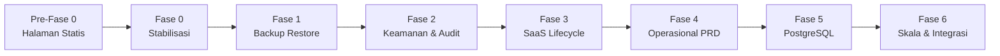
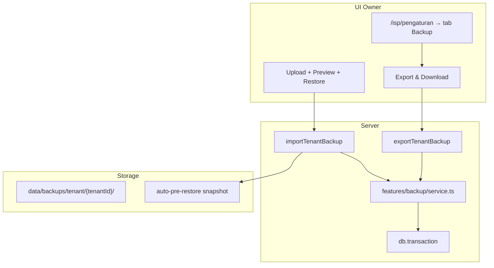
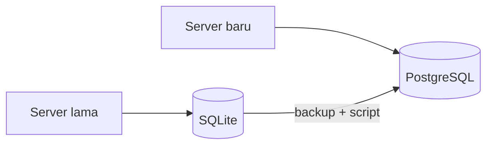
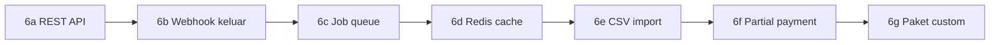
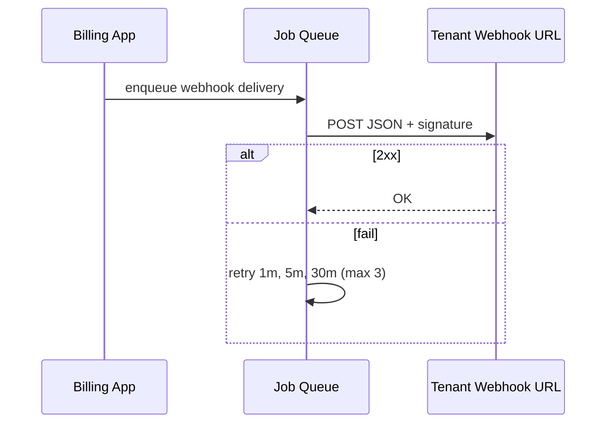
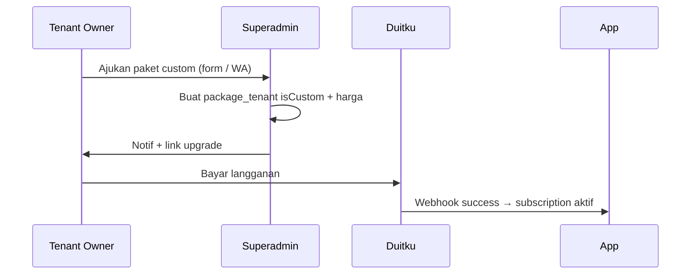

# Roadmap Implementasi NetManage — Urutan Fokus Kerja

> Rencana berurutan untuk pengembangan NetManage dari MVP ke production-grade, termasuk **Backup & Restore** agar ISP bisa mengelola dan melindungi datanya sendiri.

**Status:** Draft — siap dieksekusi per fase  
**Branch disarankan:** satu fase = satu branch (`feat/backup-restore`, `feat/audit-log`, dst.)  
**Prinsip:** selesaikan satu fase → deploy → uji production → baru lanjut fase berikutnya.

---

## Cara pakai dokumen ini

1. Kerjakan **Pre-Fase 0** dulu (halaman statis platform).
2. Lanjut **Fase 0** (stabilisasi deploy yang sudah ada).
3. **Fase 1 (Backup & Restore)** — jadikan safety net sebelum migrasi DB atau fitur besar lain.
4. Jangan loncat ke Fase 5 (PostgreSQL) sebelum Fase 1–3 selesai.
5. Centang checklist di setiap fase saat selesai.



| Fase | Fokus | Estimasi | Risiko jika dilewati |
|------|--------|----------|----------------------|
| **Pre-0** | Halaman statis + editor superadmin | 0.5–1 hari | Situs tanpa Tentang/Kontak/T&C |
| 0 | Stabilisasi production | 0.5 hari | Bug deploy / schema error |
| 1 | **Backup & Restore ISP** | 2–3 hari | Kehilangan data saat update |
| 2 | Keamanan & audit log | 2 hari | Password router bocor, tidak ada jejak |
| 3 | Langganan SaaS otomatis | 1 hari | Tenant expired tetap aktif |
| 4 | Gap PRD operasional | 4–5 hari | Kolektor offline, tiket tanpa foto |
| 5 | Migrasi PostgreSQL | 1–2 hari | SQLite lock di skala besar |
| 6 | API & skala lanjutan | 2–3 minggu | Integrasi pihak ketiga terbatas |

---

## Pre-Fase 0 — Halaman statis platform (Tentang, Kontak, T&C)

**Tujuan:** Halaman publik yang bisa diedit superadmin sebelum stabilisasi production.

**Status:** Implemented

### Checklist

- [x] Tabel `platform_settings` (singleton) di schema + `ensure-schema`
- [x] Halaman publik: `/tentang`, `/kontak` (tombol WhatsApp), `/syarat-ketentuan`
- [x] Submenu Pengaturan (klik expand): Profil App, Logo Brand, Pemilik, Alamat, Halaman Statis
- [x] Brand platform editable (ganti NetManage) — homepage, title browser, footer, superadmin sidebar
- [x] Link footer di semua halaman publik & auth
- [x] Menu Pengaturan di sidebar superadmin

### File utama

| Path | Fungsi |
|------|--------|
| `src/lib/db/schema.ts` | Tabel `platform_settings` |
| `src/features/platform-settings/` | Service, actions, defaults, WhatsApp helper |
| `src/app/tentang/page.tsx` | Halaman Tentang |
| `src/app/kontak/page.tsx` | Halaman Kontak + wa.me |
| `src/app/syarat-ketentuan/page.tsx` | Syarat & Ketentuan |
| `src/app/superadmin/pengaturan/` | Layout Pengaturan + sub-nav |
| `src/app/superadmin/pengaturan/halaman-statis/` | Form editor halaman statis |

### Deploy

```bash
npm run db:ensure-schema
npm run build
pm2 restart billingisp
```

### Selesai jika

Superadmin bisa edit teks → simpan → halaman publik langsung berubah; tombol WhatsApp di `/kontak` membuka chat.

---

## Fase 0 — Stabilisasi production (selesaikan dulu)

**Tujuan:** Pastikan build saat ini stabil di VPS sebelum menambah fitur.

### Checklist

- [ ] `git pull` + `npm ci` + `npm run db:ensure-schema` + `npm run build` + `pm2 restart billingisp`
- [ ] Smoke test: login owner, pelanggan, kolektor, portal OTP, `/isp/peta`, cron billing (`curl .../api/cron`)
- [ ] Backup manual file DB sekali (`cp netmanage.db netmanage.db.manual.bak`)
- [ ] Dokumentasi env production lengkap (Duitku, WA, `CRON_SECRET`, `MAP_MODEM_CACHE_SECONDS`)

### Selesai jika

Semua menu utama bisa diakses tanpa error 500; cron billing jalan; peta tidak spam error Mikrotik offline.

---

## Fase 1 — Backup & Restore data ISP ⭐ (prioritas Anda)

**Tujuan:** Owner/admin ISP bisa **export**, **download**, dan **restore** data bisnis mereka tanpa akses SSH ke server.

### 1.1 Ruang lingkup data

#### Export per tenant (untuk ISP — menu Pengaturan)

| Termasuk | Tidak termasuk |
|----------|----------------|
| Profil tenant (nama, logo, tema) | Session login |
| Staf tenant (user dengan `tenantId`) | OTP pelanggan |
| Router, paket internet, ODP | Data tenant lain |
| Pelanggan, invoice, tiket + assignment | Paket SaaS platform (`package_tenant`) |
| Pengeluaran + kategori | Superadmin |
| Konfig integrasi Duitku/WA (encrypted) | Log pembayaran platform subscription* |

\* Log subscription platform bisa di-exclude atau di-mask — keputusan: **exclude** dari export ISP (hanya data operasional ISP).

#### Backup penuh platform (superadmin saja)

- Snapshot file SQLite via `better-sqlite3` `.backup()` → download `.db` atau `.zip`
- Opsional: cron server harian ke folder `backups/` (retention 7 hari)

### 1.2 Format file backup tenant

```json
{
  "format": "netmanage-tenant-backup",
  "version": 1,
  "exportedAt": "2026-06-18T10:00:00.000Z",
  "tenantId": "ten_xxx",
  "tenantDomain": "demo.net",
  "appVersion": "0.1.0",
  "counts": {
    "pelanggan": 120,
    "invoice": 450,
    "router": 2
  },
  "data": {
    "tenant": { },
    "users": [ ],
    "routers": [ ],
    "paketInternet": [ ],
    "odp": [ ],
    "pelanggan": [ ],
    "invoices": [ ],
    "tickets": [ ],
    "ticketAssignments": [ ],
    "kategoriPengeluaran": [ ],
    "pengeluaran": [ ],
    "tenantDuitkuConfig": { },
    "tenantWhatsAppConfig": { }
  }
}
```

- Ekstensi file: `.netmanage.json` atau `.netmanage.json.gz` (gzip untuk ISP besar)
- Validasi schema version saat import; tolak file versi tidak dikenal

### 1.3 Mode restore

| Mode | Perilaku | UI label |
|------|----------|----------|
| **Preview** | Tampilkan ringkasan (jumlah record, tanggal export) tanpa menulis DB | "Pratinjau" |
| **Merge** | Insert record baru; skip jika ID sudah ada | "Gabungkan" |
| **Replace** | Hapus semua data tenant saat ini → import dari file | "Ganti semua data" |

**Replace** wajib:
- Konfirmasi ketik nama usaha
- Hanya role **owner**
- Backup otomatis tenant saat ini sebelum replace (simpan ke disk server + tawarkan download)

**Urutan import (foreign key):**
`users` → `routers` → `paketInternet` → `odp` (topologi: router dulu, ODP parent setelah child-less) → `pelanggan` → `invoices` → `kategoriPengeluaran` → `pengeluaran` → `tickets` → `ticketAssignments` → config integrasi

### 1.4 Arsitektur teknis



### 1.5 File & modul yang dibuat

| Path | Fungsi |
|------|--------|
| `src/features/backup/types.ts` | Tipe format backup, mode restore |
| `src/features/backup/tables.ts` | Daftar tabel per tenant + urutan FK |
| `src/features/backup/export.ts` | Query & serialize JSON |
| `src/features/backup/import.ts` | Validasi, preview, merge/replace |
| `src/features/backup/actions.ts` | Server actions (owner/superadmin) |
| `src/app/isp/pengaturan/backup-panel.tsx` | UI export/import |
| `src/app/superadmin/backup/page.tsx` | Backup full DB (superadmin) |
| `scripts/backup-tenant.ts` | CLI: `npm run backup:tenant -- --tenant-id=...` |
| `scripts/backup-full.ts` | CLI: `npm run backup:full` |
| `data/backups/.gitkeep` | Folder backup server (gitignore) |

### 1.6 UI Pengaturan ISP

Tab baru **"Backup & Restore"** di `/isp/pengaturan`:

1. **Export data**
   - Tombol "Unduh backup"
   - Info: jumlah pelanggan, invoice, tanggal terakhir export
2. **Restore data**
   - Upload file `.netmanage.json` / `.json.gz`
   - Pratinjau → pilih Merge atau Replace
   - Progress + pesan sukses/error per tabel
3. **Riwayat backup otomatis** (opsional fase 1b)
   - Daftar snapshot pre-restore + unduh

### 1.7 Keamanan

- Hanya **owner** (export + restore replace); **admin** boleh export saja
- Validasi `tenantId` di file = tenant session (tolak cross-tenant)
- Limit ukuran upload (mis. 50 MB) + scan JSON depth
- Jangan log isi password/router plaintext
- Rate limit: max 3 restore/hari per tenant

### 1.8 Checklist implementasi Fase 1

- [x] `features/backup/*` — export tenant ke JSON
- [x] Server action download (base64 attachment via browser)
- [x] Import preview + merge + replace dengan transaction
- [x] Auto-snapshot sebelum replace
- [x] UI tab Backup di `/isp/pengaturan`
- [x] Superadmin: halaman backup full SQLite + download
- [x] Script CLI `backup:tenant` dan `backup:full`
- [x] `.gitignore` → `data/backups/**`, `*.db.bak`
- [x] README: cara backup manual + restore
- [x] Test: export → hapus pelanggan → restore merge → data kembali

### 1.9 Sub-fase opsional (1b — setelah 1a stabil)

- [ ] Cron harian backup semua tenant aktif (server-side)
- [ ] Export **CSV** terpisah: pelanggan, invoice (untuk Excel)
- [ ] Email/WA notifikasi "Backup otomatis selesai" ke owner

### Selesai jika

Owner bisa unduh backup, upload kembali di server lain (staging), dan data pelanggan + invoice identik setelah restore.

---

## Fase 2 — Keamanan & jejak audit

**Tujuan:** Data sensitif aman; setiap aksi kritis bisa dilacak.

**Prasyarat:** Fase 1 selesai (backup ada sebelum enkripsi massal / migrasi).

### Checklist

- [ ] Enkripsi nyata `router.passwordEncrypted` (pakai `encryptSecret` yang sudah dipakai integrasi)
- [ ] Migrasi one-shot: encrypt password router lama saat startup / script `npm run migrate:encrypt-secrets`
- [ ] Tabel `audit_log`: `tenantId`, `userId`, `action`, `entityType`, `entityId`, `meta` JSON, `createdAt`
- [ ] Log aksi: isolir/aktifkan pelanggan, hapus pelanggan, restore backup, ubah router, bayar invoice manual
- [ ] Enforce `limitasi.fitur[]` dari paket SaaS di middleware/menu + server actions
- [ ] Rate limit OTP login portal (`/portal/login`)
- [ ] Halaman superadmin: daftar audit log (filter tenant)

### Selesai jika

Password router tidak plaintext di DB; restore backup tercatat di audit log; tenant paket Free tidak bisa akses menu yang tidak diizinkan.

---

## Fase 3 — Siklus hidup langganan SaaS

**Tujuan:** Tenant yang tidak bayar langganan platform otomatis suspend.

**Status:** Implemented

### Checklist

- [x] Perluas `/api/cron` → cek `subscription.akhir` expired
- [x] Update `tenants.status` → `suspended`; blok login owner/admin/teknisi/kolektor (kecuali superadmin)
- [x] Reminder WA 7 hari & 1 hari sebelum expire (ke owner jika nomor WA diisi)
- [x] UI superadmin: perpanjang subscription manual (+N hari)
- [x] Banner di layout ISP owner/admin: "Langganan berakhir dd/mm/yyyy"

### File utama

| Path | Fungsi |
|------|--------|
| `src/features/jobs/saas-subscription.ts` | Cron expire + reminder H-7/H-1 |
| `src/app/api/cron/route.ts` | Billing + SaaS lifecycle |
| `src/features/tenants/service.ts` | `extendTenantSubscription`, status langganan |
| `src/lib/auth/index.ts` | Blok login & session tenant suspend |
| `src/app/superadmin/tenants/page.tsx` | Perpanjang manual per tenant |
| `src/app/isp/layout.tsx` | Banner peringatan langganan |

### Selesai jika

Subscription demo expired → tenant suspend; cron tidak generate invoice untuk tenant suspend.

---

## Fase 4 — Gap PRD operasional

**Tujuan:** Fitur lapangan & helpdesk yang masih kurang.

**Status:** Implemented

**Prasyarat:** Fase 2–3 (audit + tenant lifecycle).

### 4a — Kolektor & helpdesk (prioritas tinggi)

- [x] **Offline kolektor:** IndexedDB cache daftar invoice tugas + sync saat online
- [x] **Upload foto tiket:** storage lokal `public/uploads/tickets/`; field `fotoUrl` dari upload
- [x] **Assign tiket otomatis:** teknisi terdekat (GPS) atau beban tiket paling sedikit
- [x] Portal pelanggan: lihat status tiket (open / in progress / resolved) + lampiran foto

### 4b — Laporan & admin

- [x] Export laporan PDF/Excel (invoice, P&L) — CSV, XLSX, cetak PDF browser
- [x] System health superadmin: cron last run, jumlah tenant, router offline count
- [x] Reset password staf oleh owner (dialog + edit form)
- [x] Email dan WA selamat datang setelah register tenant + bayar
- [x] Lupa password owner/staf (`/lupa-password` → email/WA → `/reset-password`)

### File utama

| Path | Fungsi |
|------|--------|
| `src/lib/offline/kolektor-store.ts` | IndexedDB cache & antrean bayar offline |
| `src/app/kolektor/kolektor-tasks.tsx` | UI offline + sync |
| `src/lib/uploads.ts` | Upload foto tiket |
| `src/features/tickets/auto-assign.ts` | Auto-assign teknisi |
| `src/app/isp/laporan/export/route.ts` | CSV + Excel |
| `src/app/isp/laporan/print/route.ts` | HTML cetak PDF |
| `src/features/platform-health/service.ts` | Cron last run + health metrics |
| `src/lib/integrations/email/` | Welcome & reset email (mock/smtp) |
| `src/lib/auth/password-reset.ts` | Lupa password staf/owner |

### Selesai jika

Kolektor buka `/kolektor` tanpa sinyal masih lihat daftar tugas terakhir; tiket bisa lampirkan foto; teknisi bisa di-assign otomatis.

---

## Fase 5 — Migrasi PostgreSQL

**Tujuan:** Database production siap multi-tenant skala menengah.

**Status:** Persiapan — **server production lama tetap SQLite**; PostgreSQL hanya di **server/deploy baru** nanti.

**Prasyarat:** Fase 1 backup production **wajib**; ikuti [`docs/database-migration-plan.md`](./database-migration-plan.md) dan [`docs/postgres-new-server-runbook.md`](./postgres-new-server-runbook.md).

### Strategi 2 server (disepakati)

| Lingkungan | Database | Catatan |
|------------|----------|---------|
| **Server lama (production sekarang)** | SQLite `netmanage.db` | **Tidak diubah** — deploy rutin seperti biasa |
| **Server baru (nanti)** | PostgreSQL | Clone repo, migrate data, Nginx, cutover DNS opsional |
| **Dev lokal** | SQLite (default) | Postgres opsional untuk uji migrasi |



**Branch kode:** `feat/postgres-migration` — dual driver + schema PG; jangan paksa server lama pakai Postgres.

### Checklist — Persiapan kode (repo)

- [x] `DATABASE_DRIVER=sqlite|postgres` (default **sqlite**)
- [x] `schema.pg.ts` + script `db:generate:pg` / `db:migrate:pg`
- [x] Script `npm run db:migrate-sqlite-to-pg`
- [x] Runbook server baru — [`postgres-new-server-runbook.md`](./postgres-new-server-runbook.md)
- [x] Dual `db/index.ts` (SQLite prod / Postgres server baru)
- [x] Generate & commit folder `drizzle/pg/` (`npm run db:generate:pg`)
- [x] Pre-deploy backup `pg_dump` + superadmin full backup `.sql` (server PG)

### Checklist — Server lama (jangan ubah)

- [x] `DATABASE_URL=./netmanage.db` (tanpa `DATABASE_DRIVER=postgres`)
- [x] `npm run db:ensure-schema` tetap dipakai setiap deploy
- [ ] Backup rutin sebelum mulai uji di server baru

### Checklist — Server baru (cutover nanti)

- [ ] Provision PostgreSQL + `.env` dengan `DATABASE_DRIVER=postgres`
- [ ] `npm run db:migrate:pg` + import data SQLite
- [ ] PM2/systemd + Nginx + cron
- [ ] Smoke test 24 jam ([runbook](./postgres-new-server-runbook.md))
- [ ] Cutover DNS (opsional) atau subdomain baru dulu

### Dampak pada Backup & Restore

- Format JSON tenant **tetap sama** (DB-agnostic)
- Full backup superadmin: `pg_dump` → `.sql` di server PG; SQLite `.backup()` di server lama
- Pre-deploy backup dashboard: `data/backups/platform/pre-deploy-*.sql` (PG) atau `*.db` (SQLite)

---

## Fitur Pesan WhatsApp & Template Reminder

**Status:** Implemented

- [x] Kirim tunggal & massal ke pelanggan (ISP owner/admin) — `/isp/pesan`
- [x] Kirim tunggal & massal ke owner tenant (superadmin) — `/superadmin/pesan`
- [x] Template editable dengan placeholder `[[nama_pelanggan]]`, `[[tagihan]]`, dll.
- [x] Cron billing & SaaS memakai template tenant/platform
- [x] Throttle: random delay + pause 30 detik tiap 10 pesan; massal via background batch

| Path | Fungsi |
|------|--------|
| `src/features/messages/` | Template, render, throttle, send, batch |
| `src/app/isp/pesan/` | UI ISP |
| `src/app/superadmin/pesan/` | UI superadmin |
| `scripts/send-message-batch.ts` | Background mass send |

Env: `WA_SEND_DELAY_MIN_MS`, `WA_SEND_DELAY_MAX_MS`, `WA_SEND_BATCH_SIZE`, `WA_SEND_BATCH_PAUSE_MS`

---

## Fase 6 — Skala & integrasi lanjutan

**Tujuan:** Platform SaaS matang untuk banyak tenant, integrasi pihak ketiga, dan beban operasional tinggi tanpa membebani cron single-process.

**Status:** Belum dimulai — rencana detail di bawah.

**Prasyarat (wajib sebelum mulai):**

| # | Prasyarat | Alasan |
|---|-----------|--------|
| 1 | Fase 0 smoke test production | Baseline stabil sebelum API publik |
| 2 | Fase 1 backup tenant + full DB | Rollback jika import/API salah |
| 3 | Fase 2 audit log (minimal) | Jejak akses API key & webhook |
| 4 | Fase 5 cutover Postgres di server baru (disarankan) | Skala multi-tenant + concurrent API |
| 5 | `APP_TIMEZONE` + PM2 auto-start | Billing & webhook timestamp konsisten |

**Branch disarankan:** pecah per sub-fase — `feat/api-v1`, `feat/webhook-outbound`, `feat/job-queue`, dst.



| Sub-fase | Fokus | Estimasi | Deliverable |
|----------|--------|----------|-------------|
| **6a** | REST API read-only | 2–3 hari | API key + `/api/v1/*` |
| **6b** | Webhook keluar | 1–2 hari | Event invoice paid / isolir |
| **6c** | Job queue | 2–3 hari | Retry WA & batch Mikrotik |
| **6d** | Redis cache Mikrotik | 1 hari | Ganti in-memory `modem-status.ts` |
| **6e** | Bulk import CSV | 1–2 hari | Upload pelanggan massal |
| **6f** | Partial payment & dunning | 3–4 hari | Cicilan + urutan penagihan |
| **6g** | Approval paket custom | 1–2 hari | Workflow superadmin |

---

### 6a — REST API (read-only dulu)

**Tujuan:** Tenant ISP bisa integrasi dengan script, mobile app, atau ERP tanpa scrape dashboard.

#### Autentikasi

| Mekanisme | Detail |
|-----------|--------|
| Header | `Authorization: Bearer <api_key>` |
| Scope | Per tenant — key hanya baca data `tenantId` pemilik key |
| Penyimpanan | Tabel `tenant_api_key`: hash key (SHA-256), prefix 8 char untuk identifikasi, `label`, `createdAt`, `lastUsedAt`, `revokedAt` |
| UI | `/dashboard/integrasi` → tab **API Key** (owner/admin) — generate, revoke, copy sekali |
| Rate limit | 60 req/menit/key (env `API_RATE_LIMIT_PER_MIN`) |

#### Endpoint v1 (read-only)

Base path: `/api/v1`

| Method | Path | Query | Response |
|--------|------|-------|----------|
| GET | `/pelanggan` | `page`, `limit`, `status`, `q` | `{ data: Pelanggan[], meta: { page, total } }` |
| GET | `/pelanggan/:id` | — | `{ data: PelangganDetail }` |
| GET | `/tagihan` | `page`, `status`, `pelangganId`, `periode` | `{ data: Tagihan[] }` |
| GET | `/tagihan/:id` | — | `{ data: TagihanDetail }` |
| GET | `/invoice` | `page`, `status`, `pelangganId` | `{ data: Invoice[] }` (nota legacy) |
| GET | `/router` | — | `{ data: Router[] }` (tanpa password) |
| GET | `/router/:id/status` | — | `{ data: { online, lastCheck, activeSessions } }` |
| GET | `/health` | — | `{ ok: true, tenantId, appVersion }` |

Contoh response pelanggan (ringkas):

```json
{
  "data": {
    "id": "pel_xxx",
    "nama": "Budi",
    "noWa": "62812...",
    "status": "active",
    "paket": "20 Mbps",
    "tglJatuhTempo": "2026-06-15",
    "routerId": "rtr_xxx"
  }
}
```

#### File & modul

| Path | Fungsi |
|------|--------|
| `src/lib/db/schema.*.ts` | Tabel `tenant_api_key` |
| `src/features/api-keys/service.ts` | Generate, hash, verify, revoke |
| `src/features/api-keys/actions.ts` | Server actions UI integrasi |
| `src/lib/api/auth.ts` | Middleware auth Bearer → `tenantId` |
| `src/lib/api/response.ts` | Envelope JSON + error codes |
| `src/app/api/v1/pelanggan/route.ts` | List pelanggan |
| `src/app/api/v1/pelanggan/[id]/route.ts` | Detail |
| `src/app/api/v1/tagihan/route.ts` | List tagihan |
| `src/app/api/v1/router/[id]/status/route.ts` | Status router (reuse Mikrotik client) |
| `src/app/dashboard/integrasi/` | Tab API Key + dokumentasi endpoint |

#### Checklist 6a

- [ ] Schema `tenant_api_key` + migrasi SQLite/PG
- [ ] UI generate/revoke API key di Integrasi
- [ ] Middleware auth + rate limit
- [ ] GET pelanggan, tagihan, invoice (read-only)
- [ ] GET router status (mask credential)
- [ ] Audit log: `api_key.created`, `api_key.used` (butuh Fase 2)
- [ ] README: contoh `curl` + OpenAPI stub (`docs/api-v1.openapi.yaml`)

#### Selesai jika

Owner generate key → `curl` list pelanggan → data match dashboard; key tenant A tidak bisa baca tenant B.

---

### 6b — Webhook keluar (outbound)

**Tujuan:** Sistem tenant (ERP, bot Telegram, n8n) menerima notifikasi real-time saat event billing.

#### Event yang didukung (fase awal)

| Event | Trigger | Payload inti |
|-------|---------|--------------|
| `tagihan.paid` | Tagihan lunas (manual/kolektor/Duitku) | `tagihanId`, `pelangganId`, `amount`, `paidAt`, `metode` |
| `pelanggan.isolated` | Cron isolir tunggakan | `pelangganId`, `reason`, `tunggakanTotal` |
| `pelanggan.activated` | Bayar lunas → aktifkan kembali | `pelangganId` |

#### Konfigurasi per tenant

Tabel `tenant_webhook`:

| Kolom | Keterangan |
|-------|------------|
| `url` | HTTPS endpoint tenant |
| `secret` | HMAC signing (encrypted) |
| `events` | JSON array event subscribed |
| `isEnabled` | boolean |
| `lastDeliveryAt` | timestamp |
| `failureCount` | untuk circuit breaker |

Signature header: `X-NetManage-Signature: sha256=<hmac(body, secret)>`

#### Delivery & retry



- Fase awal: inline POST + log ke `webhook_delivery_log` (tanpa queue)
- Fase 6c: pindah ke queue dengan retry

#### Hook points (kode existing)

| Event | File hook |
|-------|-----------|
| `tagihan.paid` | `src/features/billing/tagihan-service.ts` — setelah mark paid |
| `pelanggan.isolated` | `src/features/billing/tagihan-service.ts` — `isolateOverdueUnpaid` |
| `pelanggan.activated` | `src/features/customers/service.ts` — sync Mikrotik aktif |

#### Checklist 6b

- [ ] Schema `tenant_webhook` + `webhook_delivery_log`
- [ ] UI Integrasi → tab Webhook (URL, secret, pilih event)
- [ ] Dispatcher `features/webhooks/dispatch.ts`
- [ ] HMAC signature + verifikasi docs untuk tenant
- [ ] Test endpoint di UI ("Kirim event uji")
- [ ] Log delivery + status di superadmin (opsional)

#### Selesai jika

Tenant set URL webhook → bayar tagihan → endpoint tenant menerima POST `tagihan.paid` dengan signature valid.

---

### 6c — Job queue (Inngest / BullMQ)

**Tujuan:** Cron & operasi berat tidak blocking request; retry otomatis untuk WA dan Mikrotik.

#### Kandidat job

| Job | Trigger | Hari ini | Target |
|-----|---------|----------|--------|
| `billing.cycle` | Cron `/api/cron` | Sync inline | Queue worker |
| `messages.batch` | Mass WA | Script `send-message-batch.ts` | Queue |
| `webhook.deliver` | Event 6b | Inline POST | Queue + retry |
| `mikrotik.syncBatch` | Manual / cron | Per-request | Batch per router |
| `wa.retry` | Send gagal | Log only | Exponential backoff |

#### Rekomendasi teknologi

| Opsi | Pro | Kontra |
|------|-----|--------|
| **BullMQ + Redis** | Matang, retry, dashboard | Butuh Redis server |
| **Inngest** | Serverless-friendly | Vendor / self-host |
| **pg-boss** | Tanpa Redis (Postgres) | Cocok jika sudah PG |

**Keputusan sementara:** BullMQ + Redis jika 6d Redis sudah dipasang; alternatif **pg-boss** di server Postgres-only.

#### File & modul

| Path | Fungsi |
|------|--------|
| `src/lib/queue/index.ts` | Factory queue + connection |
| `src/lib/queue/workers/` | Worker per job type |
| `src/features/jobs/enqueue.ts` | Helper enqueue dari cron/actions |
| `scripts/queue-worker.ts` | `npm run queue:worker` — proses PM2 terpisah |

Env: `REDIS_URL`, `QUEUE_CONCURRENCY`, `QUEUE_MAX_RETRIES`

#### Checklist 6c

- [ ] Pilih & pasang driver queue
- [ ] Worker process PM2 (`billingisp-worker`)
- [ ] Pindahkan mass WA batch ke queue
- [ ] Pindahkan webhook delivery ke queue
- [ ] Monitoring: failed jobs + dead letter
- [ ] Cron tetap trigger enqueue (bukan run inline panjang)

#### Selesai jika

Kirim WA massal 500 nomor tidak block HTTP; job gagal retry otomatis; worker restart aman.

---

### 6d — Redis cache status Mikrotik

**Tujuan:** Kurangi hit RouterOS API saat banyak user buka `/dashboard/peta` bersamaan.

#### Kondisi sekarang

- Cache **in-memory** per proses Node: `src/features/maps/modem-status.ts`
- TTL: `MAP_MODEM_CACHE_SECONDS` (default 180 detik)
- **Masalah multi-instance:** PM2 cluster / 2 server → cache tidak shared

#### Target

| Aspek | Implementasi |
|-------|--------------|
| Store | Redis key `modem:{tenantId}:{routerId}` |
| TTL | Sama — env `MAP_MODEM_CACHE_SECONDS` |
| Fallback | Jika Redis down → in-memory lokal (graceful) |
| Invalidation | Clear saat isolir/aktifkan pelanggan |

#### Checklist 6d

- [ ] Client Redis (`ioredis`) + env `REDIS_URL`
- [ ] Refactor `modem-status.ts` → adapter memory/redis
- [ ] Load test peta 10 user concurrent
- [ ] Dokumentasi: Redis optional di dev, wajib di production skala besar

#### Selesai jika

Dua instance PM2 share cache; hit Mikrotik turun drastis saat refresh peta berulang.

---

### 6e — Bulk import pelanggan CSV

**Tujuan:** ISP onboarding ratusan pelanggan tanpa input manual satu per satu.

#### Format CSV

Kolom wajib: `nama`, `noWa`  
Kolom opsional: `alamat`, `paket`, `router`, `odp`, `tglDaftar`, `billingDay`, `connectionType`, `username`, `password`

```csv
nama,noWa,alamat,paket,billingDay
Budi Santoso,081234567890,Jl. Merdeka 1,20 Mbps,15
```

#### Alur UI

1. Upload CSV di `/dashboard/pelanggan` → **Import CSV**
2. Preview + validasi (duplikat noWa, paket tidak ada)
3. Pilih mode: **skip error** / **stop on error**
4. Background job import (queue 6c) + progress bar
5. Laporan: N sukses, M gagal + alasan per baris

#### Checklist 6e

- [ ] Parser CSV + validator `features/customers/csv-import.ts`
- [ ] UI upload + preview
- [ ] Integrasi `createPelanggan` (reuse service)
- [ ] Optional: sync Mikrotik batch via queue
- [ ] Export template CSV unduh

#### Selesai jika

Upload 100 baris valid → 100 pelanggan muncul di daftar; baris invalid dilaporkan tanpa corrupt DB.

---

### 6f — Partial payment & dunning multi-step

**Tujuan:** Tagihan bisa dibayar sebagian; penagihan otomatis bertahap (dunning).

#### Partial payment

| Aspek | Keputusan |
|-------|-----------|
| Model | Tagihan punya `amountDue`, `amountPaid`, `status`: open / partial / paid |
| Receipt | Satu nota bisa link ke banyak tagihan (sudah ada `receipt_tagihan_link`) |
| Portal | Tampilkan sisa tagihan; Duitku amount = sisa |
| Mikrotik | Isolir hanya jika tunggakan penuh melewati grace (existing logic diperluas) |

#### Dunning multi-step

| Hari relatif jatuh tempo | Aksi |
|--------------------------|------|
| H-3 | WA reminder (sudah ada `preDueRemindedAt`) |
| H+0 | Tagihan overdue → status tunggakan |
| H+3 | WA dunning step 2 (template baru) |
| H+7 | Isolir + WA final (existing cron) |

Tabel opsional: `dunning_step_log` — jejak step per tagihan.

#### Checklist 6f

- [ ] Schema: kolom partial payment di `tagihan` jika belum ada
- [ ] Service bayar sebagian (portal, kolektor, admin)
- [ ] Template WA dunning step 2 & 3
- [ ] Cron: evaluasi step dunning
- [ ] UI: riwayat pembayaran per tagihan
- [ ] Webhook `tagihan.partial_paid` (6b)

#### Selesai jika

Pelanggan bayar 50% → status partial → sisa muncul di portal; dunning step 2 terkirim otomatis.

---

### 6g — Approval paket custom (superadmin)

**Tujuan:** Tenant minta paket SaaS di luar katalog → superadmin approve → tenant bayar.

#### Alur



#### Schema (opsional)

Tabel `package_custom_request`: `tenantId`, `deskripsi`, `limitasi`, `harga`, `status` (pending/approved/rejected), `reviewedBy`.

#### Checklist 6g

- [ ] Form tenant: "Ajukan paket khusus" di `/dashboard/langganan`
- [ ] Superadmin inbox: daftar request + approve/reject
- [ ] Generate `package_tenant` dari request approved
- [ ] Notif WA/email ke owner
- [ ] Audit log approve/reject

#### Selesai jika

Tenant ajukan → superadmin approve → owner upgrade & bayar → limitasi paket baru aktif.

---

### Keamanan Fase 6 (lintas sub-fase)

| Area | Aturan |
|------|--------|
| API key | Hash di DB; tampilkan plain hanya sekali saat generate |
| Webhook | HTTPS only; HMAC wajib; timeout 10s |
| CSV import | Max 5 MB / 5000 baris; sanitize formula injection |
| Queue | Job payload tanpa password plaintext |
| Redis | AUTH + bind localhost / private network |
| Rate limit | Global + per tenant + per API key |

### Env baru (ringkas)

```env
# API
API_RATE_LIMIT_PER_MIN=60

# Redis (6c + 6d)
REDIS_URL=redis://127.0.0.1:6379

# Queue
QUEUE_CONCURRENCY=5
QUEUE_MAX_RETRIES=3

# Webhook outbound
WEBHOOK_DELIVERY_TIMEOUT_MS=10000
WEBHOOK_MAX_RETRIES=3
```

### Urutan implementasi disarankan

1. **6a** REST API — fondasi integrasi
2. **6b** Webhook keluar — manfaat langsung tenant
3. **6d** Redis — infrastruktur untuk 6c
4. **6c** Job queue — stabilkan WA & webhook
5. **6e** CSV import — operasional ISP
6. **6f** Partial payment — kompleksitas billing
7. **6g** Paket custom — workflow bisnis SaaS

### Selesai Fase 6 (keseluruhan) jika

- Tenant punya API key + webhook aktif
- Worker queue jalan terpisah dari web PM2
- Import CSV 500 pelanggan sukses
- Partial payment & dunning teruji end-to-end
- Minimal satu paket custom approved via superadmin

---

## Urutan kerja mingguan (saran praktis)

| Minggu | Fokus | Deliverable |
|--------|--------|-------------|
| **0** | Pre-Fase 0 + Fase 0 | Halaman statis + deploy stabil |
| **1** | Fase 1a | Backup export/import tenant di Pengaturan ISP |
| **2** | Fase 1b + Fase 2 | Auto-backup cron + enkripsi router + audit log |
| **3** | Fase 3 + 4a | SaaS expire cron + offline kolektor + foto tiket |
| **4** | Fase 4b | Health dashboard + export PDF |
| **5+** | Fase 5 | PostgreSQL cutover |
| **6+** | Fase 6 | REST API + webhook + queue + skala |

---

## Keputusan desain Backup (sudah dipilih)

| Pertanyaan | Keputusan |
|------------|-----------|
| Format ISP backup | JSON (gzip opsional) — mudah preview & cross-DB |
| Full platform backup | SQLite `.backup()` / pg_dump — superadmin only |
| Siapa boleh restore? | Owner only (replace); admin export only |
| Restore cross-server? | Ya — asalkan app version & schema version compatible |
| CSV export? | Fase 1b (pelanggan + invoice) |

---

## Langkah Anda berikutnya

1. **Selesaikan Fase 0–5** yang masih terbuka (smoke test, cutover Postgres server baru).
2. **Fase 6a:** branch `feat/api-v1` — schema `tenant_api_key` + GET pelanggan/tagihan.
3. **Fase 6b:** webhook keluar setelah API stabil.
4. Lihat checklist per sub-fase di [Fase 6](#fase-6--skala--integrasi-lanjutan) di atas.
