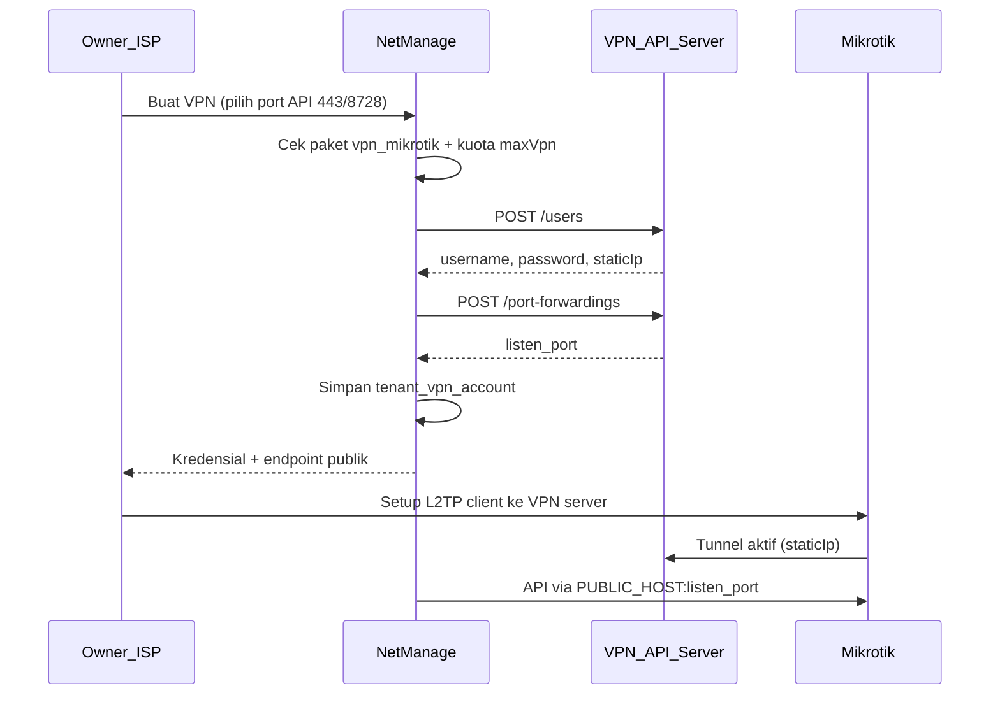

# Rencana Fitur VPN Mikrotik untuk Tenant

> Integrasi VPN API (L2TP user + port forwarding NAT ke API Mikrotik) agar owner tenant bisa membuat koneksi VPN dari dalam aplikasi, dengan kuota `maxVpn` per paket SaaS dan kredensial API platform di `.env`.

**Status:** Implemented  
**Referensi API:** [VPN API Management (GitHub)](https://github.com/klicknet55-prog/vpn_api/blob/main/README.md)  
**Akses menu:** Owner, Admin (paket dengan fitur `vpn_mikrotik`)

---

## Checklist implementasi

- [x] Buat modul `src/lib/integrations/vpn-api` (mock + real, Basic Auth, rollback)
- [x] Tabel `tenant_vpn_account` + migrasi PG/SQLite + delete-cascade
- [x] Tambah `maxVpn` + fitur `vpn_mikrotik` + helper `saas-access` + quota snapshot
- [x] Service/actions create/list/delete VPN dengan alokasi IP/port
- [x] Halaman `/isp/vpn`, nav gating, integrasi router prefill
- [x] Update `.env.example` dan seed paket contoh `maxVpn`

---

## Konteks & tujuan

Saat ini halaman Router hanya menampilkan link eksternal [`TunnelhostServiceLinks`](../src/components/integrations/tunnelhost-service-links.tsx) ke `vpn.tunnelhost.my.id` — **tidak ada** pemanggilan API VPN di codebase.

Fitur baru akan memanggil [VPN API Management](https://github.com/klicknet55-prog/vpn_api/blob/main/README.md) (FastAPI, Basic Auth) untuk:

1. **POST `/users`** — buat akun L2TP (username, password, IP static)
2. **POST `/port-forwardings`** — NAT `listen_port` publik → `staticIp:443|8728` (API Mikrotik)

**Tidak** termasuk fase 1: proxy subdomain + SSL (`/proxy-routes`) — bisa ditambah nanti.



---

## 1. Konfigurasi platform (`.env`)

Tambah di [`.env.example`](../.env.example) — kredensial **platform saja** (pola sama seperti `KLICKNET_WA_*` / `DUITKU_*`):

```env
VPN_DRIVER=mock          # mock | real
VPN_API_BASE_URL=        # contoh: http://116.251.216.196:8080
VPN_API_USERNAME=
VPN_API_PASSWORD=
VPN_API_PUBLIC_HOST=     # IP/domain publik untuk billing → Mikrotik via NAT
VPN_IP_POOL_START=10.10.10.10
VPN_IP_POOL_END=10.10.10.250
VPN_LISTEN_PORT_START=18000
```

---

## 2. Client integrasi VPN API

Buat modul baru mengikuti pola [`src/lib/integrations/mikrotik/`](../src/lib/integrations/mikrotik/):

| File | Peran |
|------|-------|
| `src/lib/integrations/vpn-api/types.ts` | Kontrak client + payload |
| `src/lib/integrations/vpn-api/config.ts` | Baca env, pool IP/port |
| `src/lib/integrations/vpn-api/http.ts` | `fetch` + header `Authorization: Basic` |
| `src/lib/integrations/vpn-api/real.ts` | `createUser`, `deleteUser`, `disableUser`, `enableUser`, `createPortForwarding`, `deletePortForwarding` |
| `src/lib/integrations/vpn-api/mock.ts` | Dev tanpa server VPN |
| `src/lib/integrations/vpn-api/index.ts` | `getVpnApiClient()` via `VPN_DRIVER` |

**Rollback transaksi:** jika `createPortForwarding` gagal setelah user dibuat → panggil `DELETE /users/{username}`.

---

## 3. Database: `tenant_vpn_account`

Tabel baru di [`schema.pg.ts`](../src/lib/db/schema.pg.ts) / [`schema.sqlite.ts`](../src/lib/db/schema.sqlite.ts):

| Kolom | Keterangan |
|-------|------------|
| `id` | PK `tvpn_*` |
| `tenant_id` | FK → tenant |
| `label` | Nama tampilan (opsional) |
| `vpn_username` | Username di VPN server |
| `password_encrypted` | Password L2TP (enkripsi `encryptSecret`) |
| `static_ip` | IP static tunnel |
| `port_forward_name` | Nama rule di VPN API |
| `listen_port` | Port publik NAT |
| `destination_port` | `443` atau `8728` |
| `status` | `active` \| `disabled` |
| `created_at` / `updated_at` | |

Migrasi: `drizzle/pg/0013_tenant_vpn.sql` + patch idempotent di [`ensure-schema.ts`](../src/lib/db/ensure-schema.ts) untuk SQLite dev.

Hapus saat tenant dihapus: extend [`delete-cascade.ts`](../src/features/tenants/delete-cascade.ts) — panggil VPN API delete port-forward + user, lalu hapus baris DB.

---

## 4. Paket SaaS: kuota & gating

### Perluasan `limitasi` JSON

```typescript
{ maxPelanggan, maxRouter, maxVpn, fitur: string[] }
```

- Tambah `maxVpn` di [`SaasPackageInput`](../src/features/tenants/service.ts), [`saveSaasPackageAction`](../src/features/tenants/actions.ts), [`package-form.tsx`](../src/app/superadmin/packages/package-form.tsx)
- Fitur baru di [`saas-features.ts`](../src/features/tenants/saas-features.ts):

```typescript
vpn_mikrotik: {
  label: "VPN Mikrotik",
  description: "Buat akun VPN L2TP + port forward API router dari dashboard.",
}
```

### Helper akses paket (baru)

File: `src/features/tenants/saas-access.ts`

```typescript
tenantHasSaasFeature(tenantId, "vpn_mikrotik")
getTenantVpnQuota(tenantId) // { used, maxVpn, allowed }
```

**Aturan buat VPN:** `vpn_mikrotik` ada di `limitasi.fitur` **dan** `used < maxVpn` (default `maxVpn: 0` = tidak bisa buat).

Extend [`getTenantQuotaSnapshot`](../src/features/tenants/service.ts) untuk tampilkan `totalVpn/maxVpn` di UI.

Update seed/bootstrap: paket Standard/Premium contoh `maxVpn: 0/3` + `vpn_mikrotik` hanya di Premium.

---

## 5. Service & actions

Folder: `src/features/tenant-vpn/`

| Fungsi | Logika |
|--------|--------|
| `listTenantVpns(tenantId)` | List akun VPN tenant |
| `createTenantVpn({ tenantId, label?, destinationPort })` | Alokasi IP/port unik dari pool env + DB, generate password, panggil VPN API, simpan DB |
| `deleteTenantVpn(tenantId, id)` | Hapus port-forward + user di API, hapus DB |
| `toggleTenantVpn(tenantId, id, enabled)` | Panggil disable/enable API |

**Alokasi IP:** scan `static_ip` existing, pilih IP berikutnya dalam range `VPN_IP_POOL_START`–`VPN_IP_POOL_END`.

**Alokasi listen port:** `VPN_LISTEN_PORT_START + offset` — cek unik di DB.

**Username:** `nm-{sanitizedDomain}` atau fallback `nm-{tenantId.slice(-8)}` — cek unik di DB.

Actions: `src/features/tenant-vpn/actions.ts` — `requireUser(["owner","admin"])`, validasi quota, `revalidatePath`.

---

## 6. UI owner (ISP)

### Halaman baru: `/isp/vpn` → `/dashboard/vpn`

- `src/app/isp/vpn/page.tsx` — list VPN, kuota, tombol buat/hapus
- Form buat: label opsional + pilih **Port API Mikrotik** (`443` REST / `8728` Legacy)
- Kartu detail per VPN:
  - Username, password (tombol tampilkan), static IP
  - Endpoint untuk router: `{VPN_API_PUBLIC_HOST}:{listen_port}`
  - Instruksi singkat setup L2TP client Mikrotik
  - Tombol **"Tambah router dengan endpoint ini"** → link ke `/dashboard/router/tambah?ip=...&port=...`

### Navigasi

Tambah item **VPN** di [`app-shell.tsx`](../src/components/layout/app-shell.tsx) — hanya tampil jika `tenantHasSaasFeature(..., "vpn_mikrotik")` (server component wrapper atau prop dari layout).

### Halaman Router

- [`router/page.tsx`](../src/app/isp/router/page.tsx): tampilkan kuota VPN + link ke `/dashboard/vpn`
- Ganti atau sembunyikan tombol **"VPN REST API Mikrotik"** eksternal jika tenant punya fitur `vpn_mikrotik` (tetap fallback link untuk paket tanpa fitur)

### Prefill router

Extend [`router-create-form.tsx`](../src/features/routers/components/router-create-form.tsx) baca `searchParams` `ip` / `port` / `connectionMode` dari URL VPN.

---

## 7. Keamanan & operasional

- Password VPN disimpan terenkripsi; tampilkan sekali saat create (opsional: regenerate = delete + create baru)
- Semua panggilan VPN API **server-side only** (`server-only`)
- Owner tenant **tidak** melihat kredensial VPN API platform
- Log audit minimal: `createLogger("vpn-api")` — username + IP, tanpa password

---

## 8. Testing manual

| Skenario | Hasil |
|----------|-------|
| Paket Free (`maxVpn: 0`) | Menu VPN tersembunyi / tombol buat ditolak |
| Paket Premium (`maxVpn: 3`, `vpn_mikrotik`) | Bisa buat hingga 3 VPN |
| `VPN_DRIVER=mock` | Flow UI tanpa server VPN |
| `VPN_DRIVER=real` | User + port-forward terbuat di VPN API |
| Hapus VPN | Rule NAT + user terhapus di server |
| Tambah router dari VPN | IP/port ter-prefill |

---

## File utama yang diubah/dibuat

**Baru:** `src/lib/integrations/vpn-api/*`, `src/features/tenant-vpn/*`, `src/app/isp/vpn/*`, `drizzle/pg/0013_tenant_vpn.sql`

**Ubah:** `schema.pg.ts`, `schema.sqlite.ts`, `tenants/service.ts`, `tenants/actions.ts`, `saas-features.ts`, `package-form.tsx`, `app-shell.tsx`, `router/page.tsx`, `router-create-form.tsx`, `delete-cascade.ts`, `.env.example`, `seed.ts`, `bootstrap.ts`
